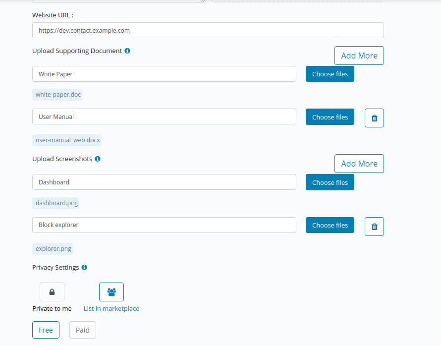
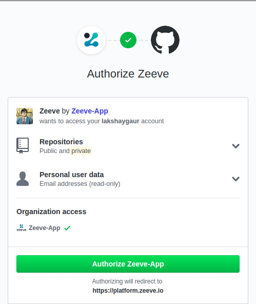

# Product Configurations

Zeeve allows the user to configure their projects onto the platform, which comes with in-built CI-CD pipelines and let Zeeve do the heavy lifting to make a network compatible for your product. This is ensured with some practices developer shall do in order to make the deployments one click based(mentioned later). There are some benefits to configure your product through Zeeve: 

* Allow automated deployments without having to configure any web servers or domain endpoints. 
* Form CI-CD pipelines. Authorizing your git account and configuring you git repository to a product.
* List your product onto marketplace to reach customers. You can either keep your products private or you can list them or marketplace as fully configured one click deployment products or as just an idea.

Following section defines how to set-up your product on the platform:

## Configuring a Product

Configuring a product allows you to do one click deployments for your product in any cloud. It is based on configuring your git repo to a product and making sure certain configuration files are utilized in a standard manner such that Zeeve can automate it to 100%.

To configure a product fully as click based deployment make sure you have seen the development practices for the relevant blockchain protocol.
- [For Hyperledger Fabric](./developmentHLF.md)
- [For Hyperledger Sawtooth](./developmentSawtooth.md)

### Steps:-

* Go to `Marketplace -> My products -> Add product`.
* Provide title and Add team members to your product.
* Select the blockchain protocol your product is built upon.
* Add a small description and logo (if any) to your product.

* Provide supporting documents( could be presentation, white paper or architecture document) for the people to understand the idea behind the product.

You can choose to keep a product private to you once you have configured it, or you can choose to list it in marketplace.

* Select the type:- Product or Idea.

**Publishing as an idea**
A product can be listed as an idea or as full deployable solution. Listing it as an idea allows the user to present it to marketplace before even the product is ready or has been implemented. Listing it as idea doesn't require any git authorizations or development practices to worry about.

To publish as an idea, simply select option `Publish my idea`.

**Configuring as a Product**
A product can be configured such that it is available to the public as a free or as a paid product. Once authrized the party can themselves deploy the product anytime they want. To configure as a product you would need to 

Zeeve will make use of the default git branch for setting up the CI-CD piepline for the project.

To configure as a product, select configure product option. It will ask for github authorization and ask you to select one of the projects. Make sure you have followed [development practices](./DevelopmentPractices.md) if you want to make your product deployable in matter of clicks. 

Once configured, you can deploy a network and choose to deploy this product on it.

* If you want to enter any running events on platform, you can select yes and select event type and problem statements.

