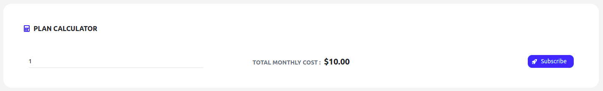
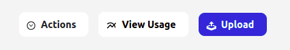
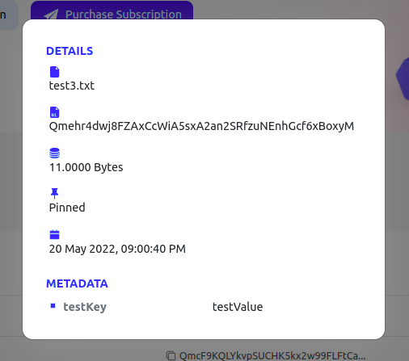
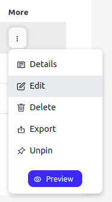
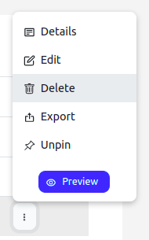
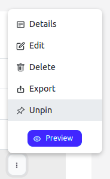
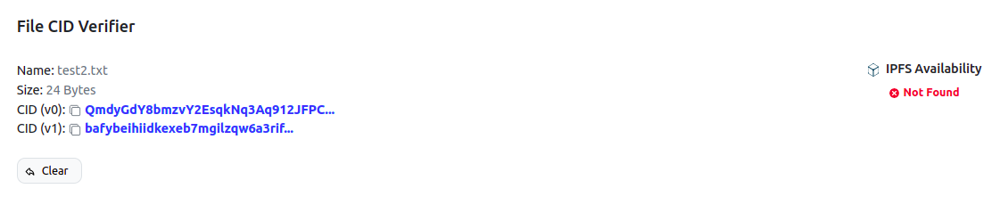
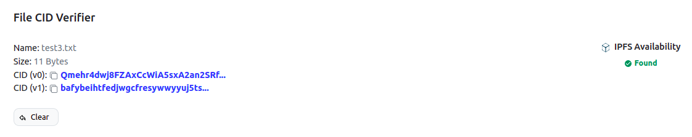

# Zeeve Distributed File System

## Overview

ZDFS is your secure and decentralised storage for your digital assets whether it be NFTs or other digital assets. It has been built by developers for developers and feature the most secure, easy to use and easy to integrate decentralised storage service. Now you don't need to hustle around [IPFS](https://docs.ipfs.io/concepts/what-is-ipfs/) complexities because ZDFS offers you the complete control over your contents using interactive [ZDFS GUI](#zdfs-gui). ZDFS allows you to upload your file, folder and content using an IPFS hash of 25GB in size. ZDFS ensures your content is always online in the IPFS network without worrying about unusual downtime and IPFS node management. ZDFS supports [IPFS CLI](#ipfs-cli) out of the box and also provides Public [HTTP APIs](#http-apis) to integrate with your application and perform various actions on your content.

There is a series of steps you need to follow in order to access ZDFS service.

1. [Purchase Subscription](#purchase-subscription).
2. [Create Access](#create-access).
3. [Usage](#usage).

## Purchase Subscription
ZDFS offers you different subscription plans and you can optimize cost as per your requirement using the plan calculator. You need to purchase the endpoints of a particular plan to enjoy seamless services of ZDFS. You can purchase 'N' number of endpoints of a particular plan on a monthly basis.

---
***NOTE:** We are referring **1 ENDPOINT** as **1 Access Key**.*

---

There are two plan types offered by ZDFS currently:
* [Basic Plan](#basic-plan).
* [Standard Plan](#standard-plan).

### Basic Plan
This plan is meant for experimenting purpose where you can enjoy the following features:
    
* 1 GB Storage.
* 5 GB Bandwidth.
* API Based Access.
* Console Management.
* Pinning Service.
* Community Support.

### Standard Plan
This plan is meant for small-scale purpose where you can enjoy the following features:
* 100 GB Storage.
* 500 GB Bandwidth.
* API Based Access.
* Console Management.
* Pinning Service.
* 24x7 Hours Professional Support.

---
***INFO:** ZDFS also offers **ENTERPRISE PLAN**, you can contact us at **support@zeeve.io** to get the quotation.*

---

* Go to `ZDFS -> Purchase Subscription`.

    

* Select the plan by clicking on it.

    
* You can enter the 'N' number of endpoints you want to purchase.
* Click on the `Subscribe` button to finally crosscheck your purchase details.

    
* Click on the `Redirect for Payment` button to get redirected to the payment gateway.

    
* You can make the payment by entering your card details and applying Coupon Code if you have any.

    

## Create Access

You need to generate an access token in order to use ZDFS APIs. You need to have `AccessKey` & `AccessSecret` or `AccessToken` for the same.

* Go to `Settings/My Accounts -> API Credentials`.


* Click on the **Create Key** button. You will get the pop up form to take some information as described in the next step.

* Provide **Key Name** as per your choice.
* Select `ZDFS` as **Service Type**.
* Select **Permissions** as per your requirement. Actions are having direct relation with API methods present in the [API Document](https://documenter.getpostman.com/view/19460118/Uz59PKx3).

* Click on the **Create Key** button in order to generate it.

* Please write down `AccessKey`, `AccessSecret` and `AccessToken` at a safe place.
* Close the pop by clicking on the Cancel button.
* You can see all your generated access keys within the same section.


## Usage
You can utilize ZDFS services in ample ways as per your use case. There are 3 ways in which you can use ZDFS as follows:

1. [IPFS CLI](#ipfs-cli). 
2. [HTTP APIs](#http-apis).
3. [ZDFS GUI](#zdfs-gui).

### IPFS CLI
Command-line users benefit from `ipfs pin remote` commands, which simplify remote pinning operations. The built-in pinning service API client executes all the necessary remote calls under the hood.

#### Configure ZDFS in IPFS CLI
You need to have an [access token](#create-access) with **Pinned Service APIs** permissions.

Open a terminal and execute the following command:
```sh
ipfs pin remote service add zdfs https://app.zeeve.io/zdfs-api/api/psa ACCESS_TOKEN
```

For more information please refer to [API documentation](https://documenter.getpostman.com/view/19460118/Uz59PKx3#625abd70-ea77-4cf6-9972-0b2baec0ec4c).

### HTTP APIs

ZDFS offers you public APIs to integrate in your application. An [access token](#create-access) is required to be sent with each request in the HTTP authorization header. [Learn More](https://documenter.getpostman.com/view/19460118/Uz59PKx3#4fd9d6f7-d067-4b65-8b21-91b24762059a)

There are two types of HTTP APIs:
1. [Pinning Service API (PSA)](#1-pinning-service-api-psa).
2. [Data APIs](#2-data-apis).


#### 1. Pinning Service API (PSA)
Pinning Service API is meant for the purpose of performing operation on remote IPFS node of ZDFS. Pinning Service API spec is standardized specification for the developers and pinning service providers. Pinning Service API reduces the learning curve because of standardization. [Learn More](https://documenter.getpostman.com/view/19460118/Uz59PKx3#fcd873f3-acdb-4776-a34c-25233832e7b6).

#### 2. Data APIs
ZDFS goes beyond in order to make the remote operation and integration of content with your application more effective. That's why your control on your content is not limited to just a few pinning methods but there are multiple other ways in which you fully access your content and make a seamless pipeline with your application. [Learn More](https://documenter.getpostman.com/view/19460118/Uz59PKx3#c3bdc0b7-d67a-43a5-8f7c-fa4ce6054968)

### ZDFS GUI
ZDFS provides you with a good and interactive console to manage your content on a click of a button. You can visualise your content and play around. Perform all the operations graphically which are possible through [Data APIs](#2-data-apis). You can even check file CID and availability on the IPFS Public Network without being uploaded on it.

You can perform multiple file based operations using ZDFS console manager in the following optimized ways.

1. [File Upload](#file-upload).
2. [File List](#file-list).
3. [File Detail](#file-detail).
4. [File Edit](#file-edit).
4. [File Delete](#file-delete).
4. [File Export](#file-export).
4. [File Unpin](#file-unpin).
4. [File Pin](#file-pin).
4. [File Preview](#file-preview).

#### File Upload
You can upload your content using file, folder or by file CID upto individual file size 25GB.

* Go to `ZDFS -> Files`.
* Click on **Upload** button.

    

* Choose from the provided upload method.
    
    

* Select a file and click on **Upload File** button to complete the process.

    

#### File List
You can organize your file or folder at the same place so that you can perform different operations individually.

* Go to `ZDFS -> Files`.
    
    

* Now, you can perform the following operations by clicking on the More (three vertical dot) button.

    

#### File Detail
You can check the details of your file in a more readable manner.

* Go to `ZDFS -> Files -> More -> Details`.

    

* Click on **Detail** button to view file detail.

    

#### File Edit
You can change the file or folder name along with the meta data.

* Go to `ZDFS -> Files -> More -> Edit`.

    

* Click on **Edit** button to edit the file detail.

    

#### File Delete
You can delete any content such that it will get automatically unpinned while removing its entry in ZDFS.

* Go to `ZDFS -> Files -> More -> Delete`.

    

* Now you will see the confirmation dialogue box to reinsure delete.

    

#### File Export
You can download your content by simply following the steps.

* Go to `ZDFS -> Files -> More -> Export`.

    

* Click on **Export** button to start downloading.

#### File Unpin
You can unpin the already pinned file or folder.

* Go to `ZDFS -> Files -> More -> Unpin`.

    

* Click on **Unpin** button to make the file unpin.

#### File Pin
You can pin the unpinned file or folder.

* Go to `ZDFS -> Files -> More -> Pin`.

    

* Click on **Pin** button to make the file pin.


#### File Preview
You can see your file directly on the IPFS gateway.

* Go to `ZDFS -> Files -> More -> Preview`.

    

* Click on **Preview** button to see your file.

#### File CID Verifier
ZDFS offers you to check the IPFS file CID IPFS hash of version 0 and 1 hashing schema. And also provides you to check its availability on IPFS Public Gateway. ZDFS ensures that you can check file CID IPFS hash of a particular content without being uploaded to the IPFS Public Gateway.


* Go to `ZDFS -> File CID Verifier`.

    

* Drag file or click inside the dotted area.

    

* Now you will be able to see file CID hash and its availability for both the cases.

    
    

* Click on **Clear** button to check for another file.

---
***NOTE:** File might get available late on IPFS Public Network after upload because it takes some time to propagate on IPFS Public Network*

---