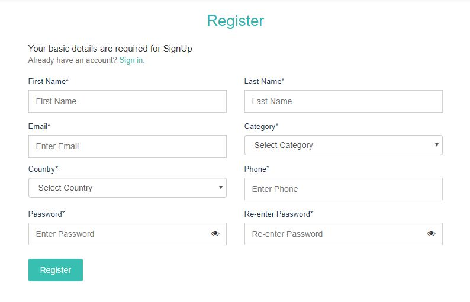
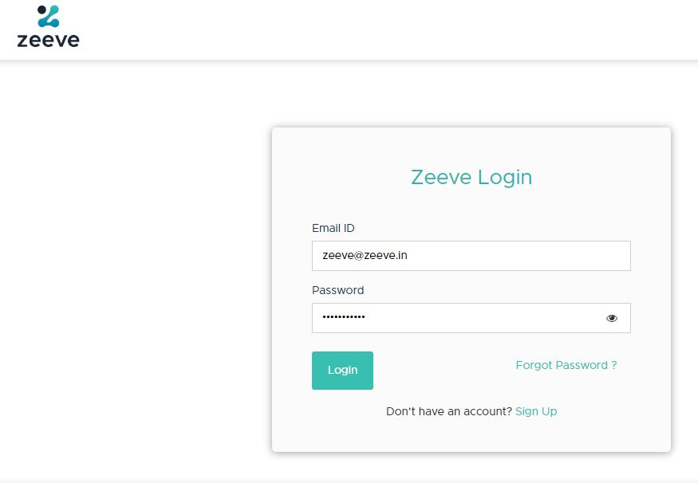

# Account Creation

This section speaks about how to create an account on Zeeve after which user can authorize external accounts/platforms on Zeeve.

1. Click on **Sign-Up** and fill all the required details. Your email-id will act as your username for login.

    

2. This will give you a account verification email, clicking which will redirect you to zeeve where you can do successful login.

    

3. After successfully login get the Welcome Page, after which user can do [authorization](cloud_authorization.md) of his/her clouds.

    

