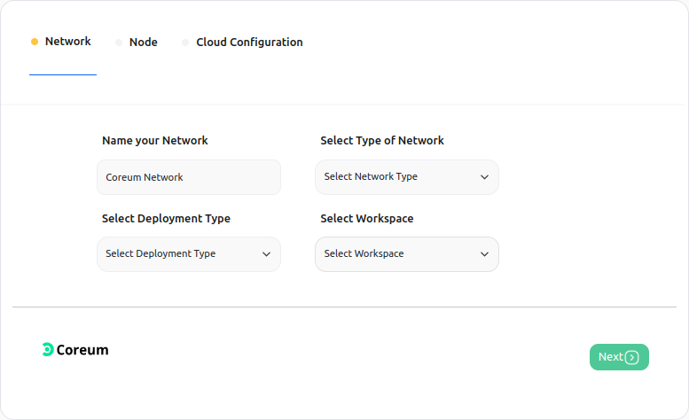
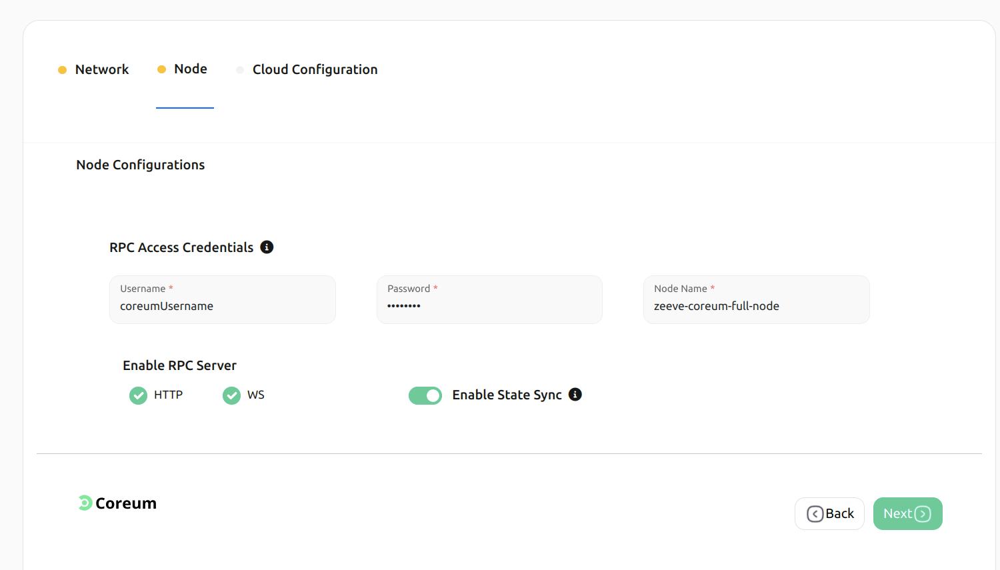
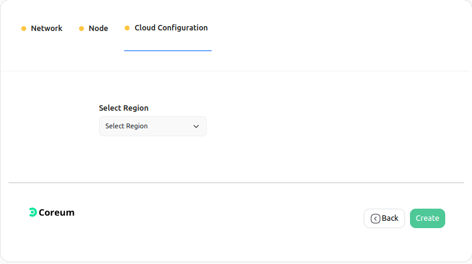
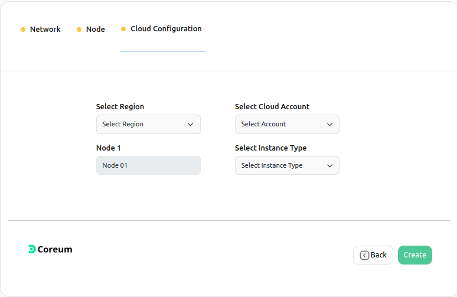
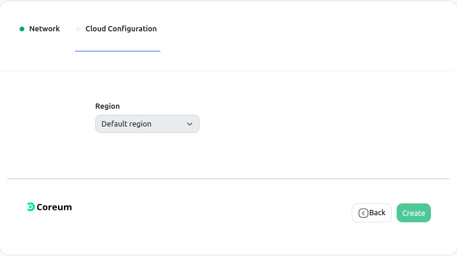
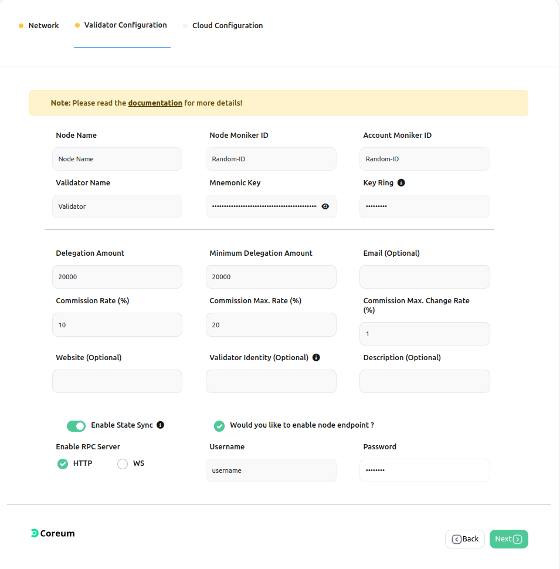
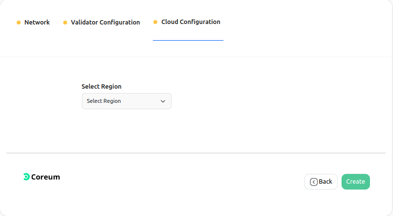

# Coreum Node Setup

This section will guide you about the different features offered by Zeeve for Coreum.

 1.  [Dedicated nodes](#dedicated-nodes)
 1.  [Staking nodes](#staking-nodes)

## Dedicated nodes

 1. [Create network](#create-a-network)
 2. [Add a node](#add-node-to-a-network)
 3. [Delete a node](#delete-node-in-a-network)
 4. [Delete network](#delete-a-network)

### **Create a network**

This section will provide you with detailed steps for creating a network of **Coreum**.

---
***NOTE*** Please make sure to follow the steps mentioned earlier before proceeding.

---

On the **Network Configuration** page you will have different cards with different network configurations for Coreum, which looks similar to the image provided below. 

  

---
***NOTE:** These cards can be different for your case. Card configurations depend on your purchased subscription.*

---

You can Choose **Zeeve-Managed-Cloud** (Zeeve's managed hosting) for the infrastructure of your node or you can use your cloud account (AWS/DO) for the hosting of your node.

Choose the configuration you want. Click on the card and follow the steps accordingly.

1. **Network Info:** 
Clicking on the card you will be landed on a page similar to the below image. In this section, we have to provide network-related information for ex- Network Name, Network type, etc.

    

> *   **Name of Network**: To uniquely identify your network, this field requires a unique name for it. Unique over here is in terms of the account in which you are creating your network. In case you have created some network earlier, and now you are trying to create with the same name, then the [Zeeve](https://zeeve.io) platform won't allow you to create it.
> *  **Deployment Type**: Deployment type
> *  **Type Of Network**
>     *   **TestNet**: This will deploy your network on the network testnet. you can use this for your non-production needs like testing or demonstrations.
> *  **Workspace**: This represents the workspace in which the network will be added after successful creation.

After providing all the details correctly go to the next step by clicking on the **Next Step** button.

2. **Node Configuration:** 
In this section, you have to fill in the details of the nodes you want to add to your network.

    

> * **Username & Password**: Choose the username and password of your choice. These will be used as RPC API credentials.
> * **Node Name**: To identify your nodes, this field will be used. 
> * **MonikerId**: A unique ID is required.
> *  **Rpc Server**: RPC, which stands for "Remote Procedure Call," is a group of protocols and interfaces that let us talk to the blockchain system. Through the RPC interface, we can ask for information about the blockchain (such as block number, blocks, node connection, etc.) and send a request for a transaction. 
    >     * **HTTP**: Uses individual HTTP requests and responses for each call, similar to a RESTful API.
    >     * **ws**: WebSocket uses a persistent connection that allows the server to push data to the client.

After providing the details click on **Next step** to go to the last step.

3. **Cloud Configuration:**
This is the step for the configuration of the cloud for your nodes. This step can be different based on your selection of **Network configuration cards**
 
    1. [Zeeve Managed](#zeeve-managed)
    2. [BYOC - AWS](#byoc---aws)
    3. [BYOC - DO](#byoc---do)

---
#### Zeeve Managed
---

In the case of **Zeeve Managed**, you don't have to bother about anything, just select the region for the network by clicking on **Select Region**.

  

> * **Region**: It indicates the region of cloud service. These regions are the geographic locations where your network instances are going to be hosted.

---
#### BYOC - AWS
---

In the case of **BYOC - AWS**, select the region for the network by clicking on **Select Region**, select the [AWS](./cloud_authorization.md) account you want to use by clicking on **Select Cloud Account**, also choose the instance type as your requirement by clicking on **Select Instance Type**.  

  

> * **Region**: It indicates the region of cloud service. These regions are the geographic locations where your network instances are going to be hosted. In the case of AWS, each of its regions has multiple, isolated locations known as Availability Zones. Amazon RDS provides you the ability to place resources, such as instances, and data in multiple locations. Resources aren't replicated across AWS Regions unless you do so specifically. [Ref.](https://docs.aws.amazon.com/AmazonRDS/latest/UserGuide/Concepts.RegionsAndAvailabilityZones.html)
> * **Cloud Account**: It represents the AWS cloud account that is going to be used for network creation. 
> *   **Type of Instance**: It defines the combination of CPU cores and memory. Choose the configuration which could handle loads of your network. This parameter is useful for scaling up the network. The type of Instances may vary from cloud to cloud.

---
#### BYOC - DO
---

In the case of **BYOC - DO**, select the region for the network by clicking on **Select Region**, select the [Digital Ocean](./cloud_authorization.md) account you want to use by clicking on **Select Cloud Account**, also choose the instance type as your requirement by clicking on **Select Instance Type**.  

  

> * **Region**: It indicates the region of cloud service. These regions are the geographic locations where your network instances are going to be hosted. In the case of DigitalOcean, each of its regions has multiple, isolated locations known as Availability Zones. Digitial Ocean provides you the ability to place resources, such as instances, and data in multiple locations. Resources aren't replicated across it's Regions unless you do so specifically. [Ref.](https://docs.digitalocean.com/products/platform/availability-matrix/#available-datacenters)
> * **Cloud Account**: It represents the DO cloud account that is going to be used for network creation. 
> *   **Type of Instance**: It defines the combination of CPU cores and memory. Choose the configuration which could handle loads of your network. This parameter is useful for scaling up the network. The type of Instances may vary from cloud to cloud.

1. Click on the **Create** button. A pop-up window will appear similar to the below image, which ensures the successful creation of your network.

    

5. Click on **continue** and you will be redirected to a page similar to the below image where you can see the nodes listed you've just added to the network.

### **Add node to a network**

This section will guide you on how you can add a node to a network.

1. Select the network to which you want to add a node, and click on the network card [Ref.](./View_your_network_and_nodes.md). You will get to see similar to the below image.

    

2. Click on the **Actions** button on the top right, and select the **Add Node** option. You will get to see a web page similar to that provided below.

    

3. Fill in the details for the new node and click on the **Next** button. In this step, the cloud configuration and region will be prefilled according to the configuration of the network. Click on the **Create** button and it's done! 

    
 

### **Delete node in a network**

1. Select the network, in which you want to perform the delete node action, and click on the network card [Ref.](./View_your_network_and_nodes.md). You will get to see similar to the below image.

    

2. Click on the delete icon present alongside the node. A pop-up window will open for the confirmation, click on the **yes** button to confirm.
   
    

### **Delete a network**

1. Select the network you want to delete, and click on the network card[Ref.](./View_your_network_and_nodes.md). You will get to see similar to the below image.

    

2. Click on the *Actions* button on the top right, and select the **Delete Network** option. A confirmation window will open, click on the **Yes** button, attached to it.

    

---
***NOTE*** It can take a few minutes to delete a network.

---

## Staking nodes

**NOTE** [Purchase](./subscriptions.md) a subscription before proceeding.

 1. [Create network](#create-a-network)
 2. [Add a node](#add-node-to-a-network)
 3. [Delete a node](#delete-node-in-a-network)
 4. [Delete network](#delete-a-network)

### **Create a network**

This section will provide you detailed steps for creating a network of **Coreum**.

On the **Network Configuration** page you will be able to see different configuration cards for Coreum, which looks similar to the image provided below.

  

***NOTE:** These cards can be different for your case. Card configurations depend on your purchased subscription.*

---

You can Choose **Zeeve-Managed-Cloud** (Zeeve's managed hosting) for the infrastructure of your node or you can use your cloud account (AWS/DO) for the hosting of your node.

Choose the configuration you want. Click on the card and follow the steps accordingly.

1. **Network Info:** 
Clicking on the card you will be landed on a page similar to the below image. In this section, we have to provide network-related information for ex- Network Name, Network type, etc.

    

> *   **Name of Network**: To uniquely identify your network, this field requires a unique name for it. Unique over here is in terms of the account in which you are creating your network. In case you have created some network earlier, and now you are trying to create with the same name, then the [Zeeve](https://zeeve.io) platform won't allow you to create it.
> *  **Deployment Type**: Deployment type
> *  **Type Of Network**
>     *   **TestNet**: This will deploy your network on the network testnet. you can use this for your non-production needs like testing or demonstrations.
> *  **Workspace**: This represents the workspace in which the network will be added after successful creation.

After providing all the details correctly go to the next step by clicking on the **Next Step** button.

2. **Node Configuration:** 
In this section, you have to fill in the details of the nodes you want to add to your network.

    

> * **Node Name**: To identify your nodes, this field will be used. 
> * **Node MonikerId**: A custom human readable name for this node.
> * **Account MonikerId**: Account id.
> * **Validator Name**: The name which is visible on the Coreum Explorer. 
> * **Mnemonic Key**: bip39 mnemonic passphrase of your wallet. 
> * **Key Ring**: A passprase to access your private key. 
> * **Delegation Amount**: Amount which you want to delegate/stake. 
> * **Minimum Delegation Amount**: The minimum delegation amount and must be grater or equal min_self_delegation. 
> * **Commission Rate**: The initial commission rate percentage. 
> * **Commission Max. Rate**: The maximum commission rate percentage. 
> * **Commission Max. Change Rate**: The maximum commission change rate percentage (per day). 
> * **Website**: Website you want to be reflected in the. 
> * **Validator Identity**: The optional identity signature (ex. UPort or Keybase). 
> * **Username & Password**: Choose the username and password of your choice. These will be used as RPC API credentials.
> *  **Rpc Server**: RPC, which stands for "Remote Procedure Call," is a group of protocols and interfaces that let us talk to the blockchain system. Through the RPC interface, we can ask for information about the blockchain (such as block number, blocks, node connection, etc.) and send a request for a transaction. 
    >     * **HTTP**: Uses individual HTTP requests and responses for each call, similar to a RESTful API.
    >     * **ws**: WebSocket uses a persistent connection that allows the server to push data to the client.

After providing the details click on **Next step** to go to the last step.

3. **Cloud Configuration:**
This is the step for the configuration of the cloud for your nodes. This step can be different based on your selection of **Network configuration cards**
 
    1. [Zeeve Managed](#zeeve-managed)
    2. [BYOC - AWS](#byoc---aws)
    3. [BYOC - DO](#byoc---do)

---
#### Zeeve Managed
---

In the case of **Zeeve Managed**, you don't have to bother about anything, just select the region for the network by clicking on **Select Region**.

  

> * **Region**: It indicates the region of cloud service. These regions are the geographic locations where your network instances are going to be hosted.

---
#### BYOC - AWS
---

In the case of **BYOC - AWS**, select the region for the network by clicking on **Select Region**, select the [AWS](./cloud_authorization.md) account you want to use by clicking on **Select Cloud Account**, also choose the instance type as your requirement by clicking on **Select Instance Type**.  

  

> * **Region**: It indicates the region of cloud service. These regions are the geographic locations where your network instances are going to be hosted. In the case of AWS, each of its regions has multiple, isolated locations known as Availability Zones. Amazon RDS provides you the ability to place resources, such as instances, and data in multiple locations. Resources aren't replicated across AWS Regions unless you do so specifically. [Ref.](https://docs.aws.amazon.com/AmazonRDS/latest/UserGuide/Concepts.RegionsAndAvailabilityZones.html)
> * **Cloud Account**: It represents the AWS cloud account that is going to be used for network creation. 
> *   **Type of Instance**: It defines the combination of CPU cores and memory. Choose the configuration which could handle loads of your network. This parameter is useful for scaling up the network. The type of Instances may vary from cloud to cloud.

---
#### BYOC - DO
---

In the case of **BYOC - DO**, select the region for the network by clicking on **Select Region**, select the [Digital Ocean](./cloud_authorization.md) account you want to use by clicking on **Select Cloud Account**, also choose the instance type as your requirement by clicking on **Select Instance Type**.  

  

> * **Region**: It indicates the region of cloud service. These regions are the geographic locations where your network instances are going to be hosted. In the case of DigitalOcean, each of its regions has multiple, isolated locations known as Availability Zones. Digitial Ocean provides you the ability to place resources, such as instances, and data in multiple locations. Resources aren't replicated across it's Regions unless you do so specifically. [Ref.](https://docs.digitalocean.com/products/platform/availability-matrix/#available-datacenters)
> * **Cloud Account**: It represents the DO cloud account that is going to be used for network creation. 
> *   **Type of Instance**: It defines the combination of CPU cores and memory. Choose the configuration which could handle loads of your network. This parameter is useful for scaling up the network. The type of Instances may vary from cloud to cloud.

1. Click on the **Create** button. A pop-up window will appear similar to the below image, which ensures the successful creation of your network.

    

5. Click on **continue** and you will be redirected to a page similar to the below image where you can see the nodes listed you've just added to the network.

### **Delete a network**

1. Select the network you want to delete, and click on the network card [Ref.](./View_your_network_and_nodes.md). You will get to see similar to the below image.

    

2. Click on the *Actions* button on the top right, and select the **Delete Network** option. A confirmation window will open, click on the **Yes** button, attached to it.

    

---
***NOTE*** It can take a few minutes to delete a network.

---