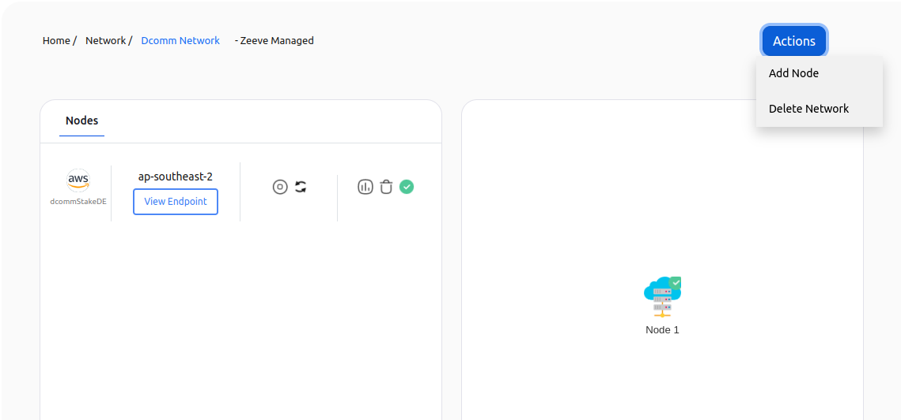

# Dcomm Staking Node Setup

**NOTE** Please make sure to [purchase](./subscriptions.md#staking-nodes) a subscription before proceeding.

1. [Create a network](#create-a-network)
2. [Add a node](#add-node-to-a-network)
3. [Delete a node](#delete-node-in-a-network)
4. [Delete a network](#delete-a-network)

---

### **Create a network**

This section will provide you with detailed steps for creating a network of **Dcomm**.

On the **Network Configuration** page you will have different cards with different network configurations for Dcomm, which looks similar to the image provided below.

**\*NOTE:** These cards can be different in your case. Card configurations depend on your purchased subscriptions.\*

---

You can Choose **Managed-AWS** (Zeeve's managed hosting) for the infrastructure of your node or you can use your cloud account (AWS/DO) for the hosting of your node.

Choose the configuration you want. Click on the card and follow the steps accordingly.

1. **Network Info**
   Clicking on the card you will be landed on a page similar to the below image. In this section, we have to provide network-related information for ex- Network Name, Network type, etc.

   

> - **Name of Network**: A name to identify your network.
> - **Deployment Type**: Deployment type
> - **Type Of Network**
>   - **TestNet**: This will deploy your network on the network testnet. you can use this for your non-production needs like testing or demonstrations.
> - **Workspace**: This represents the workspace in which the network will be added after the successful creation.

Proceed by clicking on the **Next Step** button after providing all the details.

2. **Cloud Configuration**

This is the step for the configuration of the cloud for your node. This step can be different based on your selection of **Network configuration cards**

1. [Zeeve Manged Cloud](#managed-cloud)
2. [Bring Your Own Cloud (BYOC)](#byoc)

---

#### Managed Cloud

---

In the case of **Managed - Cloud**, you don't have to bother about anything, just select the region for the network by under **Select Region**.  

> - **Region**: It indicates the region of cloud service. These regions are the geographic locations where your network instances are going to be hosted. In the case of AWS, each of its regions has multiple, isolated locations known as Availability Zones. Amazon RDS provides you the ability to place resources, such as instances, and data in multiple locations. Resources aren't replicated across AWS Regions unless you do so specifically. [Ref.](https://docs.aws.amazon.com/AmazonRDS/latest/UserGuide/Concepts.RegionsAndAvailabilityZones.html)

**\*NOTE:** The name for the node will be given automatically by Zeeve.\*

---

#### BYOC

---

In the case of **BYOC** (AWS or Digital Ocean), select the region for the network by clicking on **Select Region**, select the [Cloud](./cloud_authorization.md) account you want to use by clicking on **Select Cloud Account**, also choose the instance type as your requirement by clicking on **Select Instance Type**.  

> - **Region**: It indicates the region of cloud service. These regions are the geographic locations where your network instances are going to be hosted. In the case of AWS, each of its regions has multiple, isolated locations known as Availability Zones. Amazon RDS provides you the ability to place resources, such as instances, and data in multiple locations. Resources aren't replicated across AWS Regions unless you do so specifically. [Ref.](https://docs.aws.amazon.com/AmazonRDS/latest/UserGuide/Concepts.RegionsAndAvailabilityZones.html)
> - **Cloud Account**: It represents the cloud account that is going to be used for network creation.
> - **Node Name**: A name of the node to identify it, this field requires a unique name for it. Unique means that it should be unique in a network to which you are adding a node.
> - **Type of Instance**: It defines the combination of CPU cores and memory. Choose the configuration which could handle loads of your network. This parameter is useful for scaling up the network. The type of Instances may vary from cloud to cloud.

---

3. Click on the **Create** button. A pop-up window will appear similar to the below image, which ensures the successful creation of your network.

   

4. Click on **continue** and you will be redirected to a page similar to the below image where you can see the nodes listed you've just added to the network.

---

### **Add node to a network**

This section will guide you on how you can add a node to a network.

1. Select the network to which you want to add a node, and click on the network card. You will get to see a screen similar to the below image.

   

2. Click on the _Actions_ button on the top right, and select the **Add Node** option. You will get to see a web page similar to that provided below.

   

3. Fill in the details for the new node and click on the **Next** button. In this step, the cloud configuration and region will be prefilled according to the configuration of the network. Click on the **Create** button and it's done!

   

### **Delete node in a network**

1. Select the network, in which you want to perform the delete node action, and click on the network card [Ref.](./View_your_network_and_nodes.md). You will get to see similar to the below image.

   

2. Click on the delete icon present alongside the node. A pop-up window will open for the confirmation, click on the **yes** button to confirm.

   

### **Delete a network**

1. Select the network you want to delete, and click on the network card[Ref.](./View_your_network_and_nodes.md). You will get to see similar to the below image.

   

2. Click on the _Actions_ button on the top right, and select the **Delete Network** option. A confirmation window will open, click on the **Yes** button, attached to it.

   

---

**_NOTE_** It will take a few minutes to delete a network.

---
