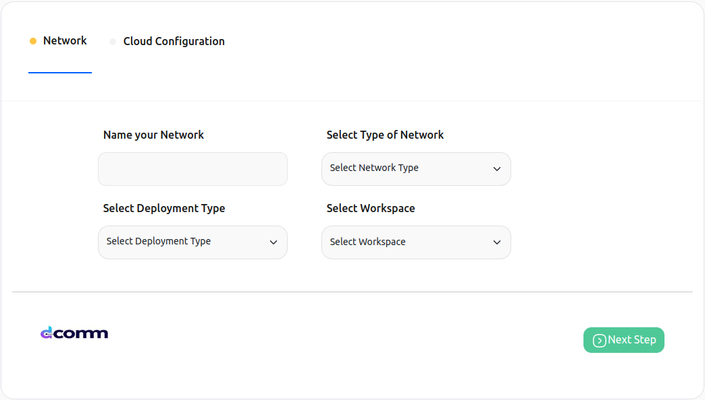
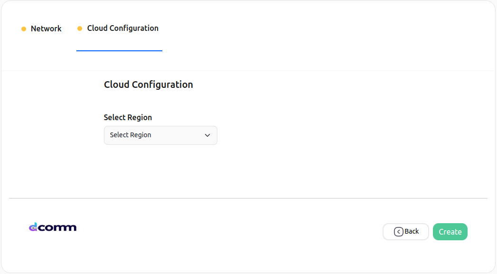
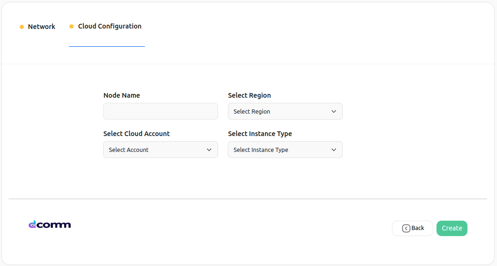
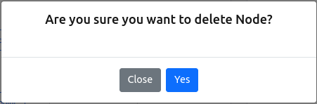

# Dcomm Staking Node Setup

**NOTE** [Purchase](./subscriptions.md) a subscription before proceeding.

1. [Create a network](#create-a-network)
2. [Add a node](#add-node-to-a-network)
3. [Delete a node](#delete-node-in-a-network)
4. [Delete a network](#delete-a-network)

---

### **Create a network**

This section will provide you detailed steps for creating a network of **Dcomm**.

On the **Network Configuration** page you will be able to see different configuration cards for Dcomm, which looks similar to the image provided below.

**\*NOTE:** These configuration cards can be different based on your purchased subscriptions.\*

---

You can Choose **Zeeve Managed Cloud** or you can use your cloud account (AWS/DO) for the infrastructure of your node.

Choose the card with the configuration you want. Clicking on the card you will be redirected to the network setup page.

1. **Network Info**

   
   &nbsp;

   > - **Network Name**: A name to identify your network.
   > - **Deployment Type**: Deployment type
   > - **Network Type**
   >   - **Melbourne Testnet**: This will deploy your network on the network testnet. you can use this for your non-production needs like testing or demonstrations.
   > - **Workspace**: This represents the workspace in which the network will be added after the successful creation.

   Proceed further by clicking on the **Next Step** button after providing all the details.

2. **Cloud Configuration**

   This step configures the cloud settings for your node. This step can vary based on your selection of **Network configuration card**

   1. [Zeeve Manged Cloud](#zeeve-managed-cloud)
   2. [Bring Your Own Cloud (BYOC)](#bring-your-own-cloud)

---

#### Zeeve Managed Cloud

---

In the case of **Managed - Cloud**, select the region for the network under **Select Region** and provide a name to your node.  

&nbsp;

> - **Node Name**: A name to identify your node, this field requires a unique name. Unique means that it should be unique in a network to which you are adding a node.
> - **Region**: It indicates the region of the cloud service. These regions are the geographic locations where your network instances are going to be hosted.

For better understanding of which region is best for you please refer the following

New York City, The US: NYC1, NYC2, NYC3 
San Francisco, The US: SFO1, SFO2 
Toronto, Canada: TOR1 
London, United Kingdom: LON1 
Frankfurt, Germany: FRA1 
Amsterdam, the Netherlands: AMS2, AMS3 
Singapore: SGP1 
Bangalore, India: BLR1 

---

#### Bring Your Own Cloud

---

In the case of **BYOC** (AWS or Digital Ocean), select the region for the network by clicking on **Select Region**, select the [Cloud](./cloud_authorization.md) account you want to use by clicking on **Select Cloud Account**, choose the instance type as your requirement by clicking on **Select Instance Type** and provide a name to your node.  

&nbsp;

> - **Node Name**: A name to identify your node, this field requires a unique name. Unique means that it should be unique in a network to which you are adding a node.
> - **Region**: It indicates the region of cloud service. These regions are the geographic locations where your network instances are going to be hosted.
> - **Cloud Account**: It represents the cloud account that is going to be used for network creation.
> - **Type of Instance**: It defines the combination of CPU cores and memory. Choose the configuration which could handle loads of your network. This parameter is useful for scaling up the network. The type of Instances may vary from cloud to cloud.

---

3. On clicking the **Create** button a pop-up window will open which ensures the successful creation of your network.

   
   &nbsp;

4. On clicking the **Continue** button you will be redirected to the page where you can see the network you created.

---

### **Add node to a network**

This section will guide you on how you can add a node to a network.

1. Visit the network detail page. Click on the _Actions_ button on the top right, and select the **Add Node** option.

   
   &nbsp;

2. You will be redirected to the node setup page. Fill the name for the new node, network type and deployment type will be prefilled based on the network configuration. Click on the **Next** button to continue.

   
   &nbsp;

3. Select the instance type for the node, cloud account and region will be prefilled based on the network configuration. Click on the **Create** button and the node will be added.
   
   &nbsp;

**_NOTE_** For Zeeve Managed Cloud, the option for selecting the instance type will not be available as it will be selected by [Zeeve](https://zeeve.io).

---

### **Delete node in a network**

1. Select the network, in which you want to perform the delete node action, and click on the network card [Ref.](./View_your_network_and_nodes.md). You will get to see a page similar to the below image.

   
   &nbsp;

2. Click on the delete icon present alongside the node. A pop-up window will open for the confirmation, click on the **Yes** button to confirm.

   
   &nbsp;

---

### **Delete a network**

1. Visit the network detail page[Ref.](./View_your_network_and_nodes.md). Click on the _Actions_ button on the top right, and select the **Delete Network** option.

   
   &nbsp;

2. A confirmation window will open, click on the **Yes** button to delete the network.

   
   &nbsp;

---

**_NOTE_** It will take a few minutes to delete a network.

---
