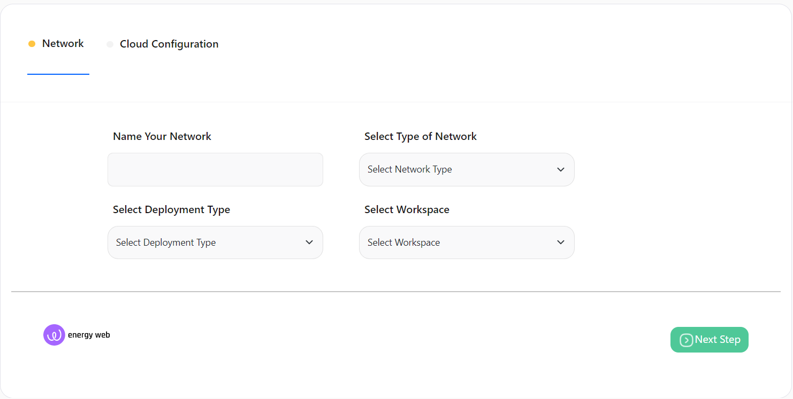
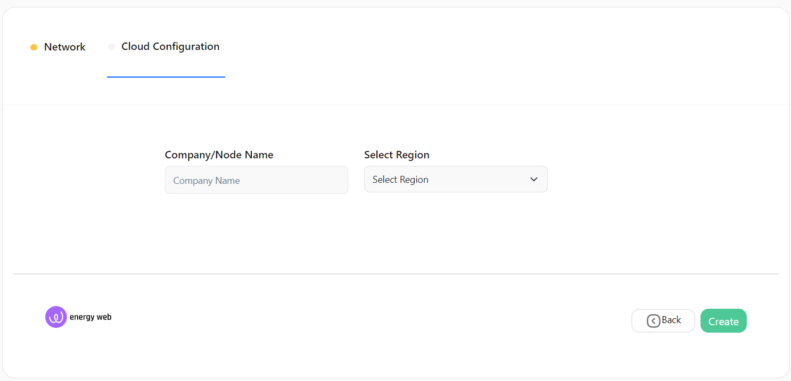
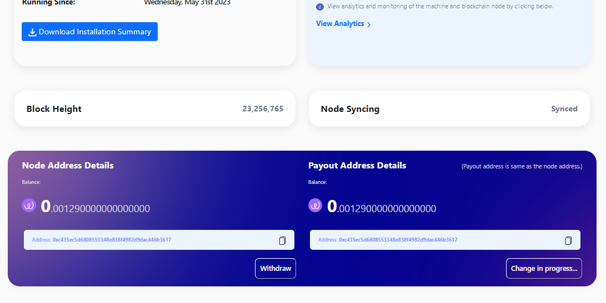
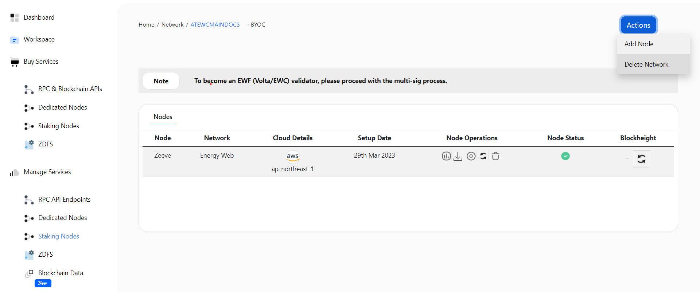
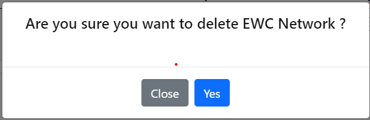

# EWC Validator Node Setup

**NOTE** [Purchase](./subscriptions.md) a subscription before proceeding.

1. [Create a network](#create-a-network)
2. [Download Installation Summary](#download-installation-summary)
2. [Withdrawal and Address Change](#withdrawal-and-address-change)
3. [View Transaction](#view-transaction)
4. [View On Explorer](#view-on-explorer)
5. [Analytics](#analytics)
6. [Alerts Section](#alerts-section)
7. [Delete a network](#delete-a-network)

---

### **Create a network**

This section will provide you detailed steps for creating a network of **EWC**.

On the **Network Configuration** page you will be able to see different configuration cards for EWC, which looks similar to the image provided below.

**\*NOTE:** These configuration cards can be different based on your purchased subscriptions.\*

---

You can Choose **Zeeve Managed Cloud** or you can use your cloud account (AWS/DO/GCP/Tencent Cloud) for the infrastructure of your node.

Choose the card with the configuration you want. Clicking on the card you will be redirected to the network setup page.

1. **Network Info**

   
   &nbsp;

   > - **Network Name**: A name to identify your network.
   > - **Deployment Type**: Deployment type
   > - **Network Type**
   >   - **Energy Web**: This will deploy your network on the network mainnet. This is suggested for deploying production-grade EWC dapps.
   >   - **Volta**: This will deploy your network on the network testnet. you can use this for your non-production needs like testing or demonstrations.
   > - **Workspace**: This represents the workspace in which the network will be added after the successful creation.

   Proceed further by clicking on the **Next Step** button after providing all the details.

2. **Cloud Configuration**

   This step configures the cloud settings for your node. This step can vary based on your selection of **Network configuration card**

   1. [Zeeve Manged Cloud](#zeeve-managed-cloud)
   2. [Bring Your Own Cloud (BYOC)](#bring-your-own-cloud)

---

#### Zeeve Managed Cloud

---

In the case of **Managed - Cloud**, select the region for the network under **Select Region** and provide a name to your node.  

&nbsp;

> - **Company/Node Name**: This is the name given to the validator node.
> - **Region**: It indicates the region of the cloud service. These regions are the geographic locations where your network instances are going to be hosted.

---

#### Bring Your Own Cloud

---

In the case of **BYOC** (AWS/Digital Ocean/GCP/Tencent Cloud), select the region for the network by clicking on **Select Region**, select the [Cloud](./cloud_authorization.md) account you want to use by clicking on **Select Cloud Account**, choose the instance type as your requirement by clicking on **Select Instance Type** and provide a name to your node.  

&nbsp;

> - **Company/Node Name**: This is the name given to the validator node.
> - **Region**: It indicates the region of cloud service. These regions are the geographic locations where your network instances are going to be hosted.
> - **Cloud Account**: It represents the cloud account that is going to be used for network creation.
> - **Type of Instance**: It defines the combination of CPU cores and memory. Choose the configuration which could handle loads of your network. This parameter is useful for scaling up the network. The type of Instances may vary from cloud to cloud.

---

3. On clicking the **Create** button a pop-up window will open which ensures the successful creation of your network.

   
   &nbsp;

4. On clicking the **Continue** button you will be redirected to the page where you can see the network you created.

**_NOTE_** To become an EWF (Volta/EWC) validator, please proceed with the multi-sig process.

---

### **Withdrawal and Address Change**

#### Amount Withdraw

   1. In the case you want to withdraw amount, click on the withdraw button in the Node Address Details panel.

      
      &nbsp;

   2. On clicking the **Withdraw** button a pop-up window will open.

      
      &nbsp;

      > - **Address**: Enter the address where you want to withdraw the amount.
      > - **Amount**: Enter the amount you want to withdraw. The amount should be more than **0.0015**.
---
   3. On clicking the **Submit** button to make the transaction. The amount withrawal will take few minutes to complete the transaction.
#### Address Change

   1. In the case you want to change Address, click on the **Change Payout Address** button in the Payout Address Details panel.

      
      &nbsp;

   2. On clicking the **Change Payout Address** button a pop-up window will open.

      
      &nbsp;

      > - **Address**: Enter the new payout address.

   3. On clicking the **Submit** button the Payout Address will be changed.

---

### **Download Installation Summary**

   1. To Download Installation Summary. Go to the detail page and click on the **Download installation summary** button.

      
      &nbsp;

   2. On clicking the **Download installation summary** button, a PDF will be downloaded with the EWF Node Install information.

      > - **Node Name**.
      > - **Validator Address**.
      > - **Enode**.
      > - **IP Address**.

      &nbsp;
      This information will be displayed in a format similar to the below image

      &nbsp;
      
      &nbsp;

**_NOTE_** Download option will be available when a node is In the Active stage.

---

### **View Transaction**
   
   1. To view all the transaction. Click on the Actions button on the top right, and select the **View Transaction** option.

      
      &nbsp;

   2. On clicking the **View Transaction** button a pop-up window will open.

      
      &nbsp;

---

### **View On Explorer**

   1. To view all Address details on the EWC Explorer. Click on the Actions button on the top right, and select the **View On Explorer** option.

      
      &nbsp;

   2. On clicking the **View On Explorer** button a new tab will open.

---

### **Analytics**

   1. To view network analytics details. Click on the View Analytics button in the Infrastructure Details panel, and click on the **View Analytics**.

      
      &nbsp;

   2. On clicking the **View Analytics** hyperlink, four button will be displayed.

      > - System metrics
      > - Blockchain metrics
      > - Logs
      > - Alerts

---

### **Alerts Section**

   1. You will see Alerts sections at the bottom of the page. Here you can see the list of Alerts related to you EWC network.

      
      &nbsp;

---

### **Delete a network**

1. Visit the [network detail page](./View_your_network_and_nodes.md). Click on the _Actions_ button on the top right, and select the **Delete Network** option.

   
   &nbsp;

2. A confirmation window will open, click on the **Yes** button to delete the network.

   
   &nbsp;

---

**_NOTE_** It will take a few minutes to delete a network.

---
