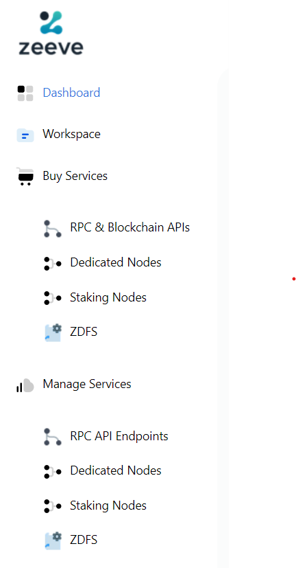

# Edit Network

This section will guide you about diffrent actions you can perform in a network. You will get a step by step guidence on how to add a node to a network, delete a node and delete a network.

  - [Add a node](#add-node-to-a-network)
  - [Delete a node](#delete-node-from-a-network)
  - [Delete a network](#delete-a-network)

## Add node to a network

This section will guide you how you can add node to a network.

1. Click on **Networks** on the left side navigation bar.

    

2. You will be landed to a page similar to below image. You can view all of your network listed on this page.

    

---
***NOTE*** This page can be different in your case.

---

3. Select the network to which you want to add a node, and click on the network card. You will get to see similar to the below image.

    

4. Click on *Actions* button on the top right, and select **Add Node** option.

## Delete node in a network

This section will guide you on how to delete a node in a network.

1. Click on **Networks** on the left side navigation bar.

    

2. You will be landed to a page similar to below image. You can view all of your network listed on this page.

    

---
***NOTE*** This page can be different in your case.

---

3. Select the network, you want to perform delete node to, and click on the network card. You will get to see similar to the below image.

    

## Delete a network

1. Click on **Networks** on the left side navigation bar.

    

2. You will be landed to a page similar to below image. You can view all of your network listed on this page.

    

---
***NOTE*** This page can be different in your case.

---

3. Select the network you want to delete, and click on the network card. You will get to see similar to the below image.

    

4. Click on *Actions* button on the top right, and select **Delete Network** option. A confirmation window will open, click on **Yes** button, attached to it.

    

---
***NOTE*** It can take few minutes to delete a network.

---