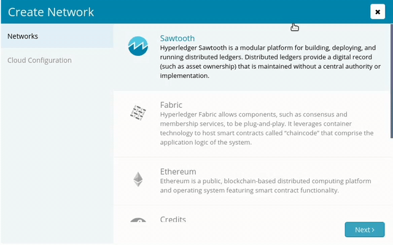

# Sawtooth Deployment Specifications

Sawtooth is a modular platform for building, deploying, and running [[Glossary|distributed ledgers]]. Provide a digital record (such as asset ownership) that is maintained without a central authority or implementation.
Sawtooth is an open source project under Hyper ledger umbrella. Sawtooth is also highly modular. This modularity enables enterprises and consortia to make policy decisions that they are best equipped to make. [Ref.](https://sawtooth.hyperledger.org/docs/core/releases/1.0/introduction.html)

> 

In order to be specific about the parameters which need your attention, we would like to brief about the parameters which need your input for creating a network

> *   **Selection of cloud type** : Prior to this, you have authenticated your cloud service viz., AWS or Azure. This section will incorporate the same cloud which you have chose, and will create the Blockchain network on it.
> *   **Name your Network** : In order to uniquely identify your network, this field requires a unique name for it. Unique over here is in terms of the account in which you are creating your network. In case you have created some network earlier, and now you are trying to create with the same name, then the [Zeeve](https://zeeve.io) platform won't allow you to create it.
> *   **Location** : It indicates the region of cloud service viz., AWS or Azure. These regions are the geographic locations where your network instances are going to be hosted. In case of AWS each of its Region has multiple, isolated locations known as Availability Zones. Amazon RDS provides you the ability to place resources, such as instances, and data in multiple locations. Resources aren't replicated across AWS Regions unless you do so specifically. [Ref.](https://docs.aws.amazon.com/AmazonRDS/latest/UserGuide/Concepts.RegionsAndAvailabilityZones.html)
> *   **Mode**
>     *   Demo Mode: If you opt this, then you would be able to create a network with single instance only. In case if you want to do like unit testing or learning or giving demo, then this option is for you! We are not restricting you to use this for the mentioned option, this is your platform and you can use it anyways.
>     *   Production Mode: If you opt for this, then you can go with as many nodes as you want to be included in your network.