# Tron Dedicated Node Setup

This section will guide you about different actions you can perform for Tron. 

 1. [Dedicated nodes](#dedicated-nodes)
 2. [API endpoints](#api-endpoints)

## Dedicated nodes

  1. [Create network](#create-a-network)
  2. [Add a node](#add-node-to-a-network)
  3. [Delete a node](#delete-node-in-a-network)
  4. [Delete network](#delete-a-network)

### **Create a network**

This section will provide detailed steps for creating a network of **Tron**.

---
***NOTE*** Please make sure to follow the steps mentioned earlier before proceeding.

---

On the **Network Configuration** page, you will have different cards with different network configurations for Tron, which looks similar to the image provided below. 

  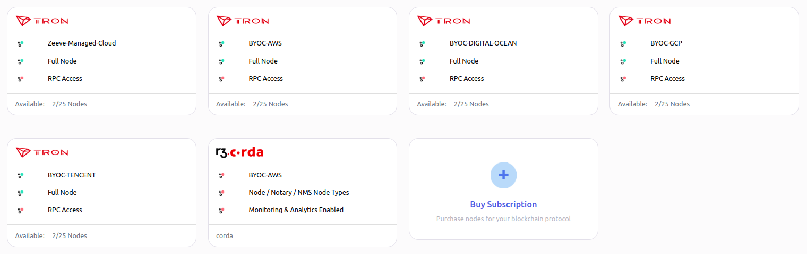

---
***NOTE:** These cards can be different for your case. Card configurations totally depend on your purchased subscription.*

---

You can choose **Managed** (Zeeve's managed hosting) for the infrastructure of your node, or you can use your own cloud account (AWS/DO/GCP/Tencent) for hosting your node.

Choose the configuration you want. Click on the card and follow the steps accordingly.

1. **Network Info** 

Clicking on the card, you will be landed on a page similar to the below image. In this section, we have to provide network-related information, ex- Network Name, Network type, etc.

  

> *   **Name of Network**: In order to uniquely identify your network, this field requires a unique name for it. Unique over here is in terms of the account in which you are creating your network. In case you have created some network earlier, and now you are trying to create one with the same name, then the [Zeeve](https://zeeve.io) platform won't allow you to create it.
> *  **Deployment Type**: Deployment type
> *  **Type Of Network**
>     *   **MainNet**: This will deploy your network on the network mainnet. This is suggested for deploying production-grade Tron dapps.
>     *   **TestNet**: This will deploy your network on the network testnet. you can use this for your non-production needs like testing or demonstrations.
> *  **Workspace**: This represents the workspace in which the network will be added after successful creation.

After providing all the details correctly, go to the next step by clicking on the **Next Step** button.

2. **Node Configuration**

In this section, you have to fill in the details of the nodes you want to add to your network.

  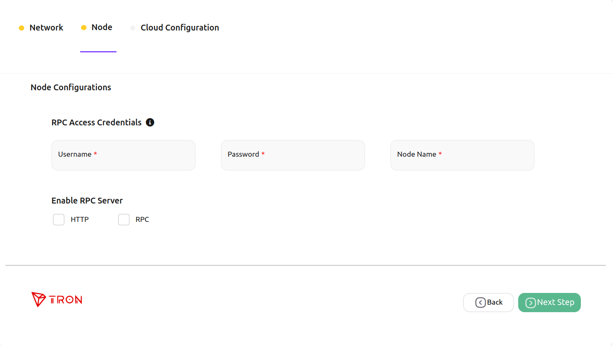

> * **Username & Password**: Choose the username and password of your choice. These will be used as RPC API credentials.
> * **Node Name**: In order to identify your nodes, this field will be used. 
> *  **RPC Server**: RPC, which stands for "Remote Procedure Call," is a group of protocols and interfaces that let us talk to the blockchain system. Through the RPC interface, we can ask for information about the blockchain (such as block number, blocks, node connection, etc.) and send a request for a transaction. 
    >     * **HTTP**: Uses individual HTTP requests and responses for each call, similar to a RESTful API.
    >     * **ws**: WebSocket uses a persistent connection that allows the server to push data to the client.
> * **JSON RPC APIs**: JSON RPC API is a bridge that allows dApps to connect to nodes.

After providing the details, click on **Next step** to go to the last step.

1. **Cloud Configuration**

This is the step for the configuration of the cloud for your nodes. This step can be different based on your selection of **Network configuration cards**
 
  1. [Manged](#managed)
  2. [BYOC - AWS](#byoc---aws)
  4. [BYOC - GCP](#byoc---GCP)
  5. [BYOC - TENCENT](#byoc---TENCENT)
  3. [BYOC - DO](#byoc---do)

---
#### Managed
---

In the case of **Managed**, you don't have to bother about anything; just select the region for the network by clicking on **Select Region**.

  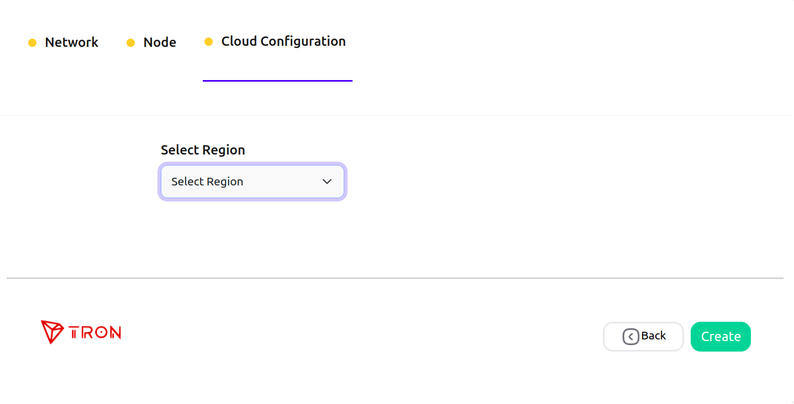

> * **Region**: In managed, you just need to select the region depending on your case and major area of operations to reduce the latency as much as possible. [Ref.](https://cloud.google.com/compute/docs/regions-zones)

---
#### BYOC - AWS
---

In the case of **BYOC - AWS**, select the region for the network by clicking on **Select Region**, select the [AWS](./cloud_authorization.md) account you want to use by clicking on **Select Cloud Account**, also choose the instance type as your requirement by clicking on **Select Instance Type**.  

  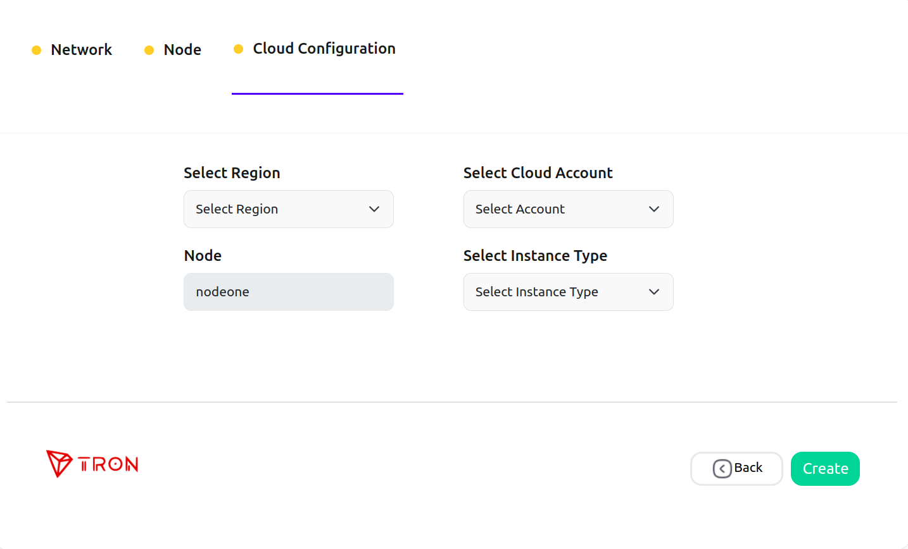

> * **Region**: It indicates the region of cloud service. These regions are the geographic locations where your network instances are going to be hosted. In the case of AWS, each of its regions has multiple isolated locations known as Availability Zones. Amazon RDS provides you the ability to place resources, such as instances and data, in multiple locations. Resources aren't replicated across AWS Regions unless you do so specifically. [Ref.](https://docs.aws.amazon.com/AmazonRDS/latest/UserGuide/Concepts.RegionsAndAvailabilityZones.html)
> * **Cloud Account**: It represents the AWS cloud account that is going to be used for network creation. 
> *   **Type of Instance**: It defines the combination of CPU cores and memory. Choose the configuration which could handle loads of your network. This parameter is useful for scaling up the network. The type of Instances may vary from cloud to cloud.

---
#### BYOC - GCP
---

In the case of **BYOC - GCP**, select the region for the network by clicking on **Select Region**, select the [GCP](./cloud_authorization.md) account you want to use by clicking on **Select Cloud Account**, also choose the instance type as your requirement by clicking on **Select Instance Type**.  

  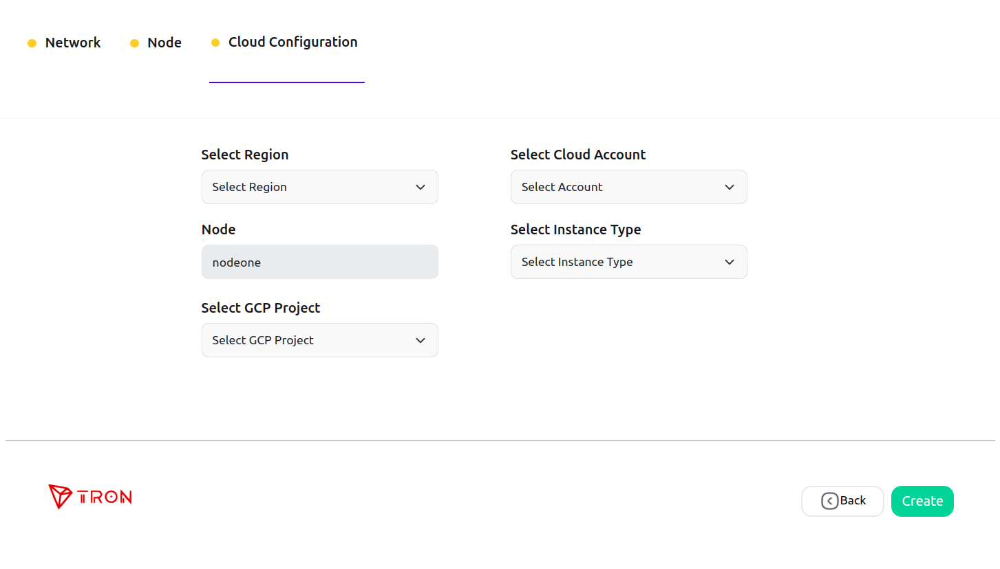

> * **Region**: GCP Compute Engine resources are hosted in multiple locations worldwide. These locations are composed of regions and zones. A region is a specific geographical location where you can host your resources. Regions have three or more zones. For example, the us-west1 region denotes a region on the west coast of the United States that has three zones: us-west1-a, us-west1-b, and us-west1-c. Putting resources in different regions provides an even higher degree of failure independence. This lets you design robust systems with resources spread across different failure domains. [Ref.](https://cloud.google.com/compute/docs/regions-zones)
> * **Cloud Account**: It represents the GCP cloud account that is going to be used for network creation. 
> *   **Type of Instance**: Here, you'll get options for different virtual machines (VM). You can select the suitable VM type in Google Cloud Platform (GCP) depending on various factors, including your workload requirements, performance needs, and budget constraints. [Ref.](https://cloud.google.com/compute/docs/machine-resource)

---
#### BYOC - TENCENT
---

In the case of **BYOC - TENCENT**, select the region for the network by clicking on **Select Region**, select the [TENCENT](./cloud_authorization.md) account you want to use by clicking on **Select Cloud Account**, also choose the instance type as your requirement by clicking on **Select Instance Type**.  

  

> * **Region**: A region is the physical location of an IDC. In Tencent Cloud, regions are fully isolated from each other, ensuring cross-region stability and fault tolerance. We recommend that you choose the region closest to your end users to minimize access latency and improve access speed. [Ref.](https://www.tencentcloud.com/document/product/213/6091)
> * **Cloud Account**: It represents the TENCENT cloud account that is going to be used for network creation. 
> *   **Type of Instance**: Here, each instance type provides different computing, memory, and storage features. You can choose the instance type that suits your application scale. Tencent Cloud provides a range of instance families with varying combinations of CPU, memory, storage, heterogeneous hardware, and network bandwidth. This gives you flexibility in selecting the appropriate mix of resources for your applications. [Ref.](https://www.tencentcloud.com/document/product/213/11518)

---
#### BYOC - DO
---

In the case of **BYOC - DO**, select the region for the network by clicking on **Select Region**, select the [Digital Ocean](./cloud_authorization.md) account you want to use by clicking on **Select Cloud Account**, also choose the instance type as your requirement by clicking on **Select Instance Type**.  

  

> * **Region**: A region is a physical location in the world where DigitalOcean has a data center. You can always see the available regions to choose from when creating a new app, [Ref.](https://docs.aws.amazon.com/AmazonRDS/latest/UserGuide/Concepts.RegionsAndAvailabilityZones.html)
> * **Cloud Account**: It represents the AWS cloud account that is going to be used for network creation. 
> *   **Type of Instance**: It defines the combination of CPU cores and memory. Choose the configuration which could handle loads of your network. This parameter is useful for scaling up the network. The type of Instances may vary from cloud to cloud.

1. Click on the **Create** button. A pop-up window will appear similar to the below image, which ensures the successful creation of your network.

    

5. Click on **continue**, and you will be redirected to a page similar to the below image, where you can see the nodes listed you've just added to the network.

### **Add node to a network**

This section will guide you on how you can add a node to a network.

1. Select the network to which you want to add a node, and click on the network card [Ref.](./View_your_network_and_nodes.md). You will get to see similar to the below image.

    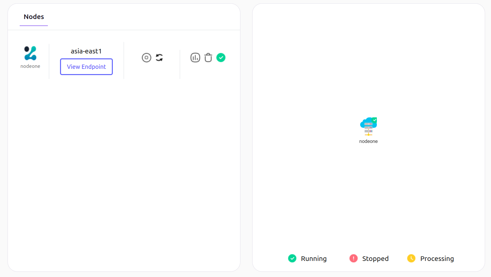

2. Click on the **Actions** button on the top right, and select the **Add Node** option. You will get to see a web page similar to that provided below.

    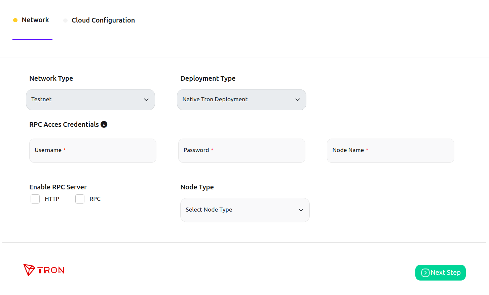

3. Fill in the details for the new node and click on the **Next** button. In this step, the cloud configuration and region will be prefilled according to the configuration of the network. Click on the **Create** button, and it's done! 

    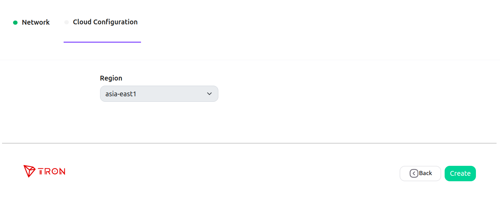
 

### **Delete node in a network**

1. Select the network you want to perform the deleted node to, and click on the network card [Ref.](./View_your_network_and_nodes.md). You will get to see similar to the below image.

    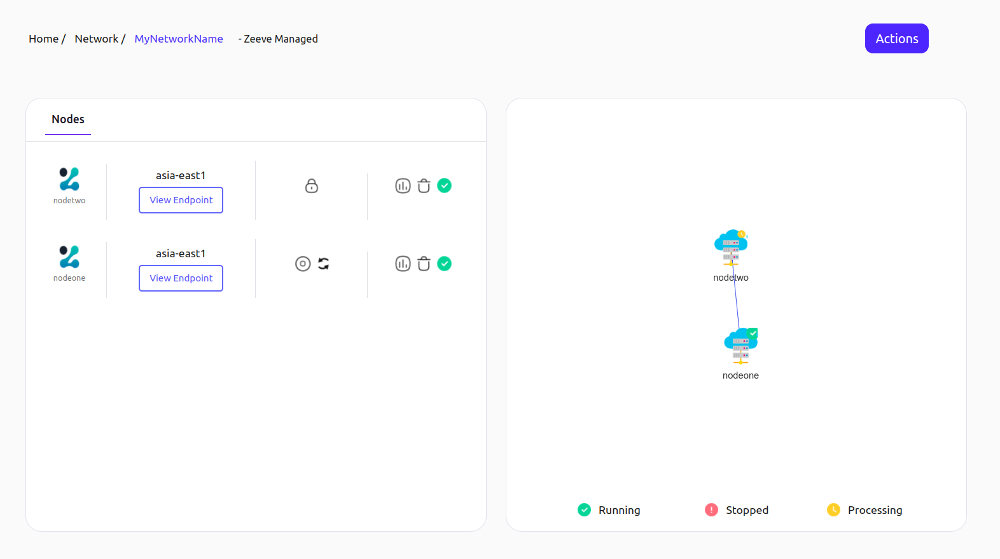

2. Click on the delete icon present alongside the node. A pop-up window will open for the confirmation; click on the **yes** button to confirm.
   
    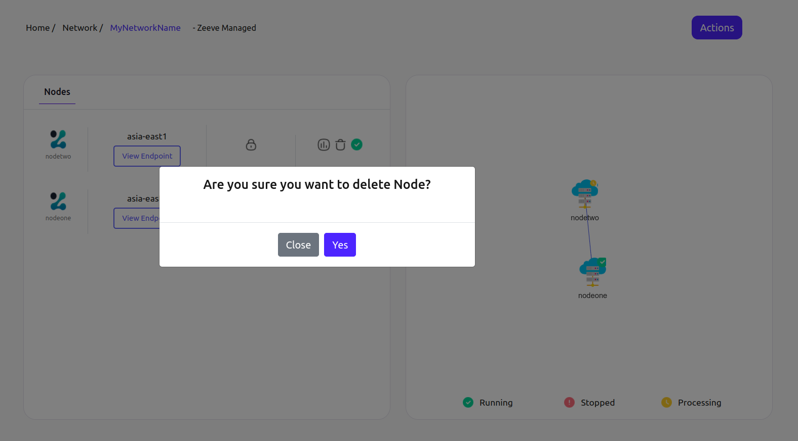

### **Delete a network**

1. Select the network you want to delete, and click on the network card[Ref.](./View_your_network_and_nodes.md). You will get to see similar to the below image.

    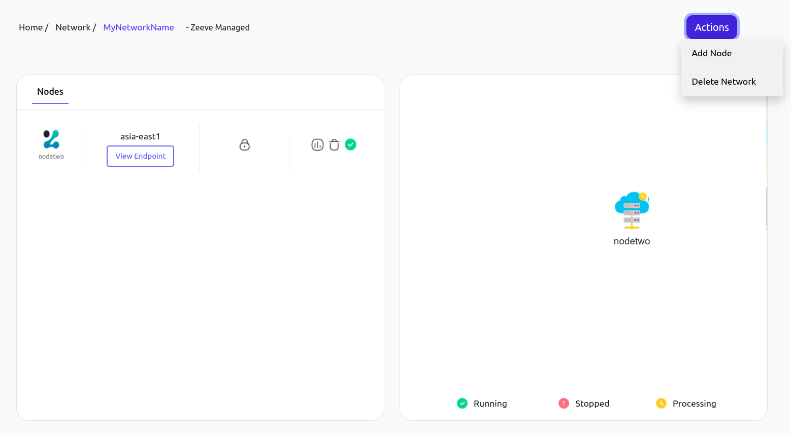

2. Click on the **Actions** button on the top right, and select the **Delete Network** option. A confirmation window will open; click on the **Yes** button attached to it.

    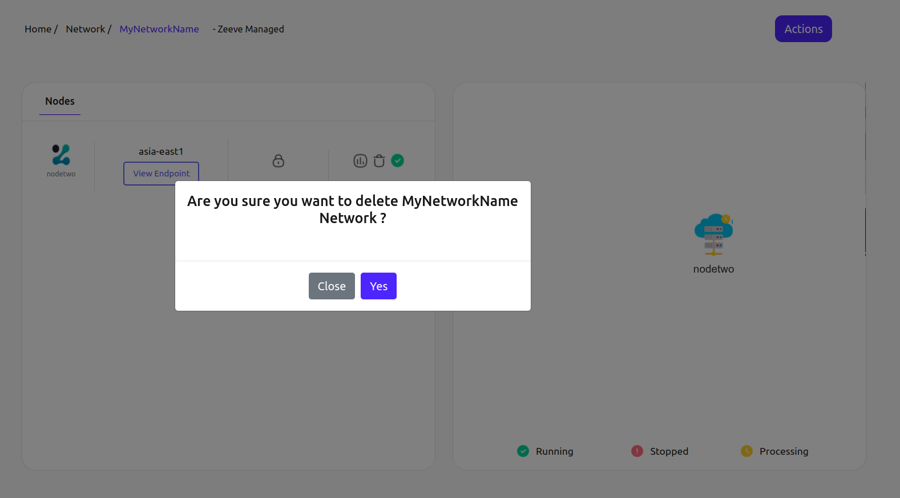

---
***NOTE*** It can take a few minutes to delete a network.

---