# Besu Node Setup
This section will guide you about the different features offered by Zeeve for Besu.

 1.  [Create Network](#create-network)
 2.  [Add node](#add-node)
 2.  [Add Transition](#add-transition)
 2.  [Delete node](#delete-node)
 2.  [Delete network](#delete-network)

### **Create network**

This section will provide you with detailed steps for creating a network of **Besu**.

---

**NOTE:** [Purchase](./subscriptions.md) a subscription before proceeding.

---

On the **Network Configuration** page you will have different cards with different network configurations for Besu, which looks similar to the image provided below. 

  

---
***NOTE:** These cards can be different for your case. Card configurations depend on your purchased subscription.*

---
you can use your cloud account (AWS) for the hosting of your node.

Choose the configuration you want. Click on the card and follow the steps accordingly.

1. **Configure Network:** 
Clicking on the card you will be landed on a page similar to the below image. In this section, we have to provide network-related information for ex- Network Name, Network description, etc.

    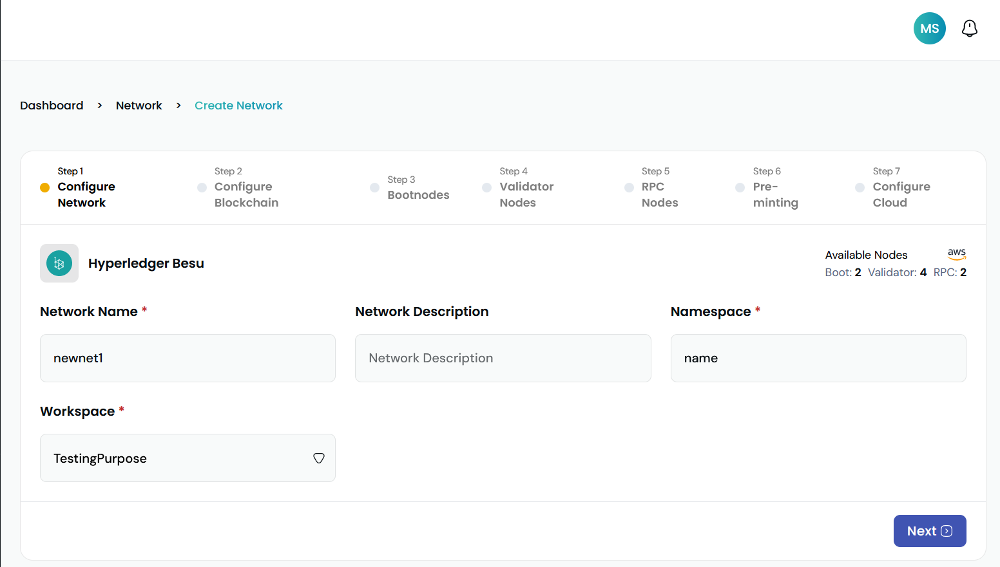

> *   **Network Name**: To uniquely identify your network, this field requires a unique name for it. Unique over here is in terms of the account in which you are creating your network. In case you have created some network earlier, and now you are trying to create with the same name, then the [Zeeve](https://zeeve.io) platform won't allow you to create it.
> *  **Network Description**: Description of the network.
> *  **Namespace**: The kubernetes namespace for the network
> *  **Workspace**: This represents the workspace in which the network will be added after successful creation.

After providing all the details correctly go to the next step by clicking on the **Next Step** button.

2. **Configuration Blockchain:** 
In this section, you have to fill in the details of the blockchain network you want to deploy.

    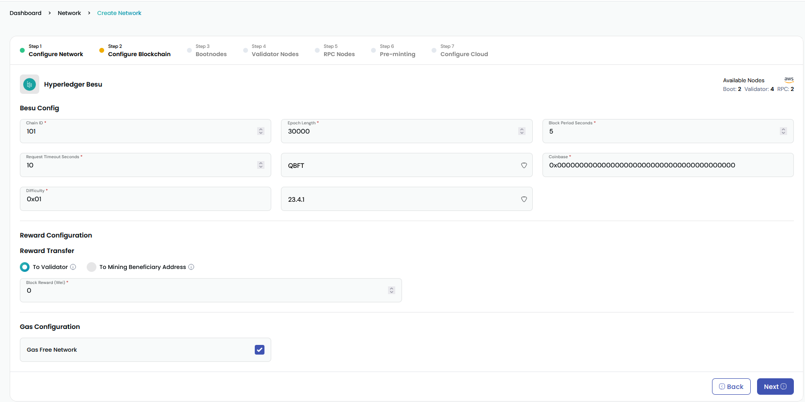

> * **Chain ID**: Chain id is require to setup network, it will be added in genesis file of the besu.
> * **Epoch Length**: Epoch length is the duration or period of time during which a specific set of validators or nodes take turns to produce and confirm blocks or transactions on the blockchain.
> * **Block Period Seconds**: Block period seconds is the time interval between the creation of consecutive blocks on a blockchain.
> * **Request Timeout Seconds**: maximum amount of time a node or client is willing to wait for a response from another node or the network when making a blockchain-related request
> * **Consensus Type**: Consensus type in blockchain refers to the agreed-upon method or algorithm used by nodes to achieve consensus on the state of the blockchain ledger.
    >     * **QBFT**: QBFT (Quorum Byzantine Fault Tolerance) is a consensus algorithm designed for use in the Quorum blockchain platform, which extends Ethereum, providing Byzantine fault tolerance for private, permissive networks.
> * **Coinbase**: Address to pay mining rewards to. Can be any value in the genesis block (commonly set to 0x0000000000000000000000000000000000000000).
> * **Difficulty**: It determines the level of complexity or effort required for miners to add a new block to the blockchain.
> * **Version**: Version of the besu network, which you want to deploy.
> * **Reward Transfer**: Select where the mining reward will go.
    >     * **To Validator**: The reward will go to the validator who validated the block.
    >     * **To Mining beneficiary**: The reward will go to the particular address.
> * **Mining beneficiary Address**: Address of the account where block reward will go. only required if **To Mining beneficiary** is selected.
> * **Block Reward**: mining reward the beneficiary get on the successful validation of a block.
> * **Gas Free Network**: When enable you can create the transaction without any gas fee in the network. when disabled you need to define **Gas Limit**  and **Price**
> * **Gas Limit**: Total gas limit for all transactions in a block.
> * **Gas Price**: The gas price is the minimum amount of cryptocurrency you have to pay for each unit of gas consumed by the transaction.

After providing the details click on **Next step** to go to the **Bootnodes** page.

3. **Bootnodes:** 
Clicking on the card you will be landed on a page similar to the below image. In this section, we have to provide Bootnode related information.

    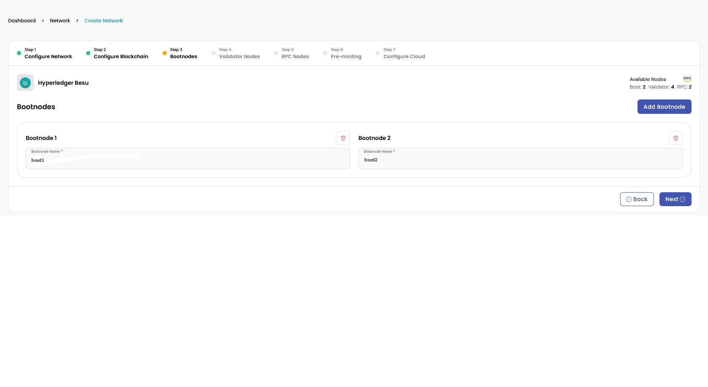

> *   **Bootnode name**: The name of the bootnode, it should be unique. You can't create any other node(rpc, validator or/and bootnode) with same name.
> *  **Add Bootnode**: To add more bootnode.
> *  **Trash Icon**: You can delete the node with the trash icon just above the **name** in top right position.

After providing the details click on **Next step** to go to the **Validator Nodes** page.

4. **Validator Nodes:** 
Clicking on the card you will be landed on a page similar to the below image. In this section, we have to provide validator related information.

    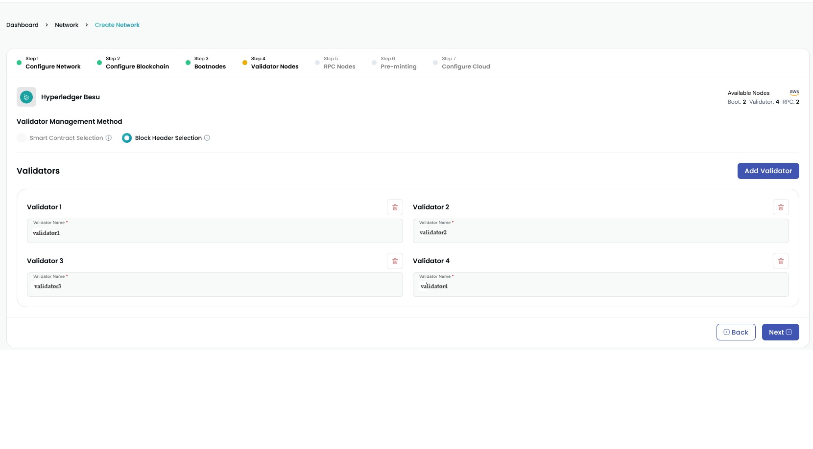

> *  **Validator Management Method**: The process of adding, removing, and maintaining validator nodes within a blockchain network.
    >     * **Block header Selection**: Existing validators propose and vote to add or remove validators using the QBFT JSON-RPC API methods.
    >     * **Smart Contract Selection**:  Use a smart contract to specify the validators used to propose and validate blocks.
> *   **Validator name**: The name of the validator node, it should be unique. You can't create any other node(rpc, validator or/and bootnode) with same name.
> *  **Add Validator**: To add more validator.
> *  **Trash Icon**: You can delete the node with the trash icon just above the **name** in top right position.

After providing the details click on **Next step** to go to the **RPC Nodes** page.

5. **RPC Nodes:** 
Clicking on the card you will be landed on a page similar to the below image. In this section, we have to provide rpc node related information.

    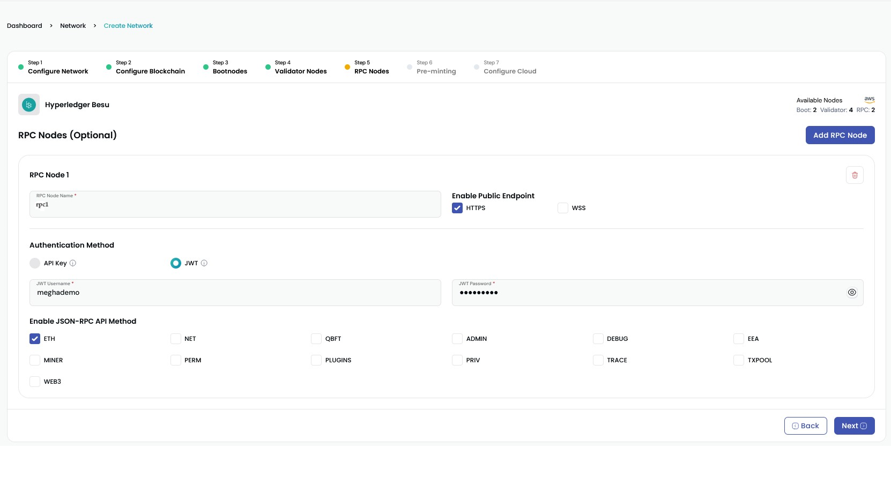

> *  **Add RPC Node**: To add more RPC node.
> *  **RPC Name**: The name of the RPC node, it should be unique. You can't create any other node(rpc, validator or/and bootnode) with same name.
> *  **Enable Public Endpoint**:
    >     * **HTTP**: Uses individual HTTP requests and responses for each call, similar to a RESTful API.
    >     * **ws**: WebSocket uses a persistent connection that allows the server to push data to the client.
> *  **Authentication Method**:
    >     * **API key**: Uses a key to authenticate the rpc calls.
    >     * **JWT**: use user name and password to generate a jwt token and use that to authenticate users.
> *  **JWT Username**: username for jwt authentication.
> *  **JWT Password**: password for jwt authentication.
> *  **Enable JSON-RPC API Method**: rpc method you want to enable for rpc.
> *  **Trash Icon**: You can delete the node with the trash icon just above the **name** in top right position.

After providing the details click on **Next step** to go to the **pre-minting** page.

6. **Pre-mining:** 
Clicking on the card you will be landed on a page similar to the below image. In this section, we have to provide pre minting related information.

    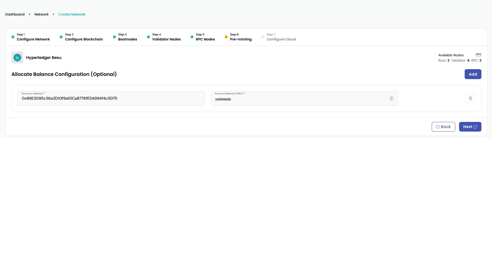
> *  **Add**: Add accounts address for pre minting tokens.
> *  **Account Address**: Address of the account for balance.
> *  **Account Balance**: Balance of that account.
> *  **Trash Icon**: You can delete the account and balance with the trash icon in the right.

After providing the details click on **Next step** to go to the **Configure cloud** page.

7. **Configure Cloud:** 
Clicking on the card you will be landed on a page similar to the below image. In this section, we have to provide Bootnode related information.

    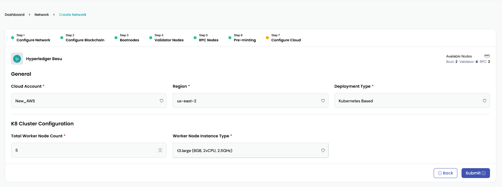
> *  **Cloud Account**: Select the cloud account.
> *  **Region**: Select the region where you want to deploy network.
> *  **Deployment Type**: Select the deployment type for the network.
> *  **Total Worker Node Count**: number of worker node in the kubernetes cluster.
> *  **Worker Node Instance Type**: instance type of the worker node.
> *  **Worker Node Instance Type**: instance type of the worker node.

Click on the **Create** button to create network.

### **Add node**

This section will guide you on how you can add a node to a deployed besu network.

1. Select the network to which you want to add a node, and click on the network card [Ref.](./View_your_network_and_nodes.md). You will get to see similar to the below image.

    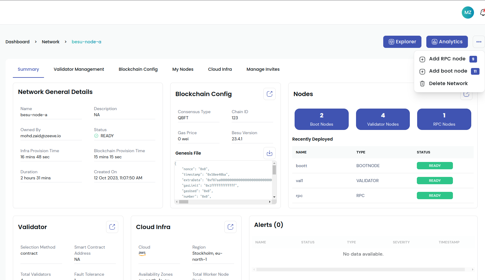

2. Click on the **...** button on the top right beside analytics, and select the **Add RPC Node** or **Add bootnode** option. You will get to see a web page similar to that provided below.

>  **Add Bootnode Page:**
    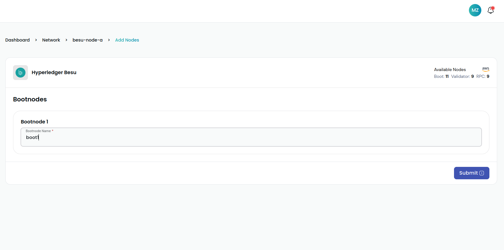
>  **Add Rpc Node Page:**
    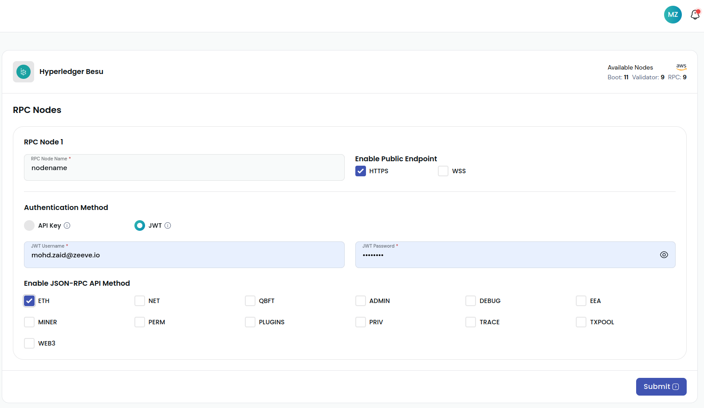

3. Fill in the details for the new node it is same as bootnode/rpc node page in create network and click on the **Next** button. Click on the **Create** button and it's done! 
 
### **Add Transition**

1. Select the network, in which you want to perform the transition action, and click on the network card [Ref.](./View_your_network_and_nodes.md). You will get to see similar to the below image.

    

2. Go to the my **Blockchain config** tab, Click on the **Add Transition** present on the top right of Transition card. A pop-up window will open for the transition details.
   
    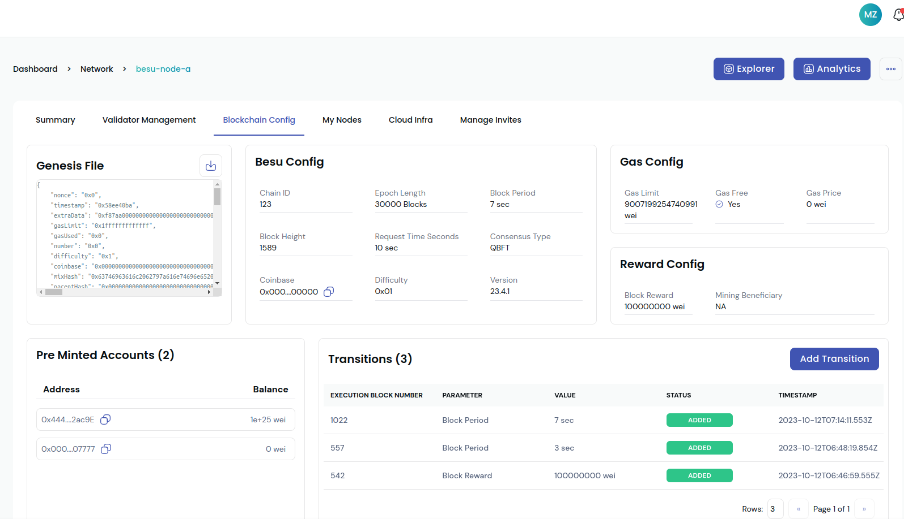

3. The modal will look similar to the below image

    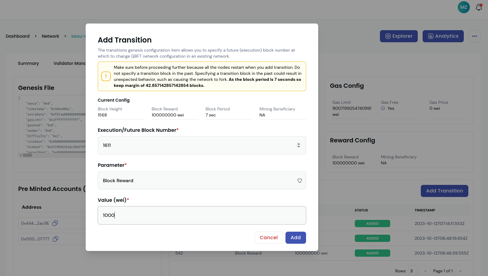
> *  **Execution/Future Block Number**: Enter the block number in which the transition of the network will occur.
> *  **Parameter**: Select the Parameter of the blockchain which will change after the future block number.
> *  **Value**: Value of that parameter.

4. After entering all the details enter **Add** button to add the transition, once added you can see it in the transition card of blockchain config tab.

### **Delete node**

1. Select the network, in which you want to perform the delete node action, and click on the network card [Ref.](./View_your_network_and_nodes.md). You will get to see similar to the below image.

    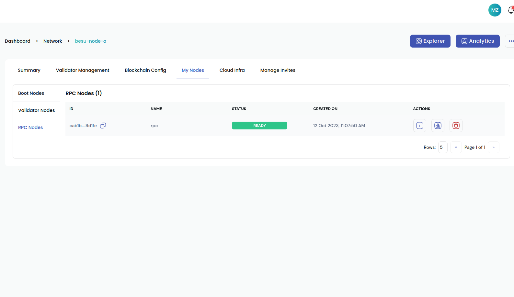

2. Go to the my nodes tab, Click on the delete icon present alongside the node. A pop-up window will open for the confirmation, click on the **yes** button to confirm.
   
    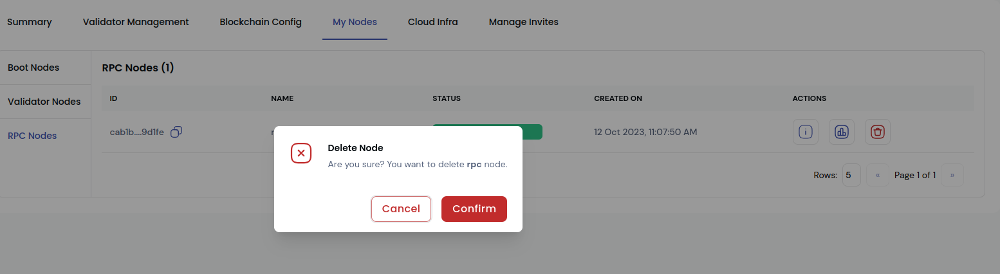

### **Delete network**

1. Select the network you want to delete, and click on the network card[Ref.](./View_your_network_and_nodes.md). You will get to see similar to the below image.

    

2.  Click on the **...** button on the top right beside analytics, and select the **Delete Network** option. A confirmation window will open, click on the **Yes** button, attached to it.

    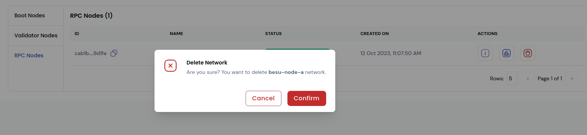

---
***NOTE*** It can take a few minutes to delete a network.

---

