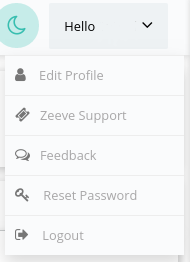
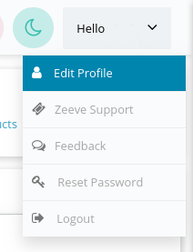
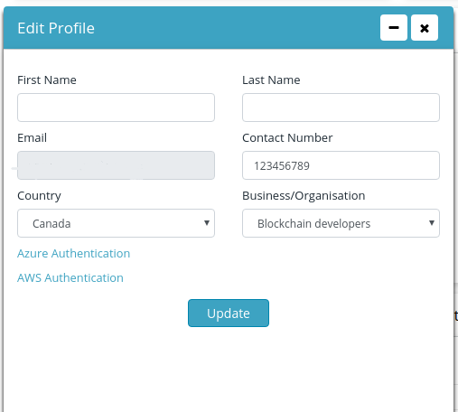
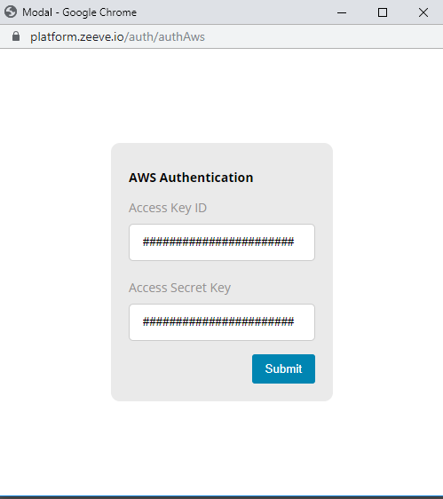

# Cloud Authorizations

Zeeve allows you to authorize multiple cloud accounts of yours so as to create networks in the cloud of your choice. You may choose to deploy some nodes of network on one cloud and extend some nodes of the same on another. This cross cloud deployment maybe a major requirement for your usecase or clients especially for creating/expanding consortiums.

Zeeve supports a list of cloud for you to choose from. You can authorize multiple clouds and choose between them at the time of creating networks or nodes. Following is the list of currently supported clouds:-

1. AWS
2. Azure
3. Digital Ocean 
4. IBM Cloud

---
***INTERESTING FACT:** Zeeve doesn't use **blockchain services** of any of the supported cloud platforms, and hence is not restricted for the level of features it can provide for a protocol on any cloud.*

---

## AWS Authorization

Before you authorize your AWS account with Zeeve, you'll need following permissions to deploy a network:
> * Permission to create VPC, Elastic Ips, EC2 instance, Security group, Internet gateway and Route tables.
> * For Fabric, you need additional permissions to read/write EKS, CloudFormation and to create and pass any Role in IAM.

To authorize your AWS account on Zeeve:-

1. Hover on **profile** 

    

2. Click on **Edit Profile**
 
    

3. Click on your cloud authentication for AWS account, click on **Authorize Aws**.
 
    

4. You will need AWS Access Key and AWS Access Secret Key, to authenticate your AWS account with Zeeve.

    

## Azure Authorization

To authorize your Azure account on Zeeve you'll need to ensure certain things:-
 
> * User must have an account with **Global Admin** Role
> * Source should be an azure **Active Directory**
> * Login from this account in Azure portal(if hasn't been logged before)
> * User must have enough permissions to write Subscription Id, create Resource group and to add any Enterprise Application into Azure Active Directory.

After ensuring these, follow the given steps:- 

1. Hover on **profile** 
 
    

2. Click on **Edit Profile**
 
    

3. Click on your cloud authentication for Azure account, click on **Authorize Azure**.

    

4. Authorize Azure will redirect you to Microsoft Azure login page, you can login with your Microsoft credentials, once login is successful, Zeeve will be connected to your Azure account.

    

## Digital Ocean Authorization

To authorize your Digital Ocean account on Zeeve you'll need to ensure certain things:-
 
> * User must have an account with enough permissions to create - 
> * Project
> * Droplets
> * and Kubernetes service.

After which on Zeeve do following steps:- 

1. Hover on **profile** 
 
    

2. Click on **Edit Profile**
 
    

3. Click on your cloud authentication for Azure account, click on **Authorize Azure**.

    

4. Authorize DigitalOcean will redirect you to login page, you can login with your DigitalOcean credentials, once login is successful, Zeeve will be connected to your account.

    

5. After this, you will be asked to allow Zeeve in your cloud account. Make sure you provide both **read and write** access on this page.

## IBM Cloud Authorization

To authorize your IBM account on Zeeve you'll need to ensure certain things:-
 
> * User must have an account with global admin role
> * Source should be an azure active directory
> * Login from this account in Azure portal(if hasn't been logged before)
> * User must have enough permissions to write subscription Id

After which on Zeeve do following steps:- 

1. Hover on **profile** 
 
    

2. Click on **Edit Profile**
 
    

3. Click on your cloud authentication for Azure account, click on **Authorize Azure**.

    

4. Authorize Azure will redirect you to Microsoft Azure login page, you can login with your Microsoft credentials, once login is successful, Zeeve will be connected to your Azure account.

    