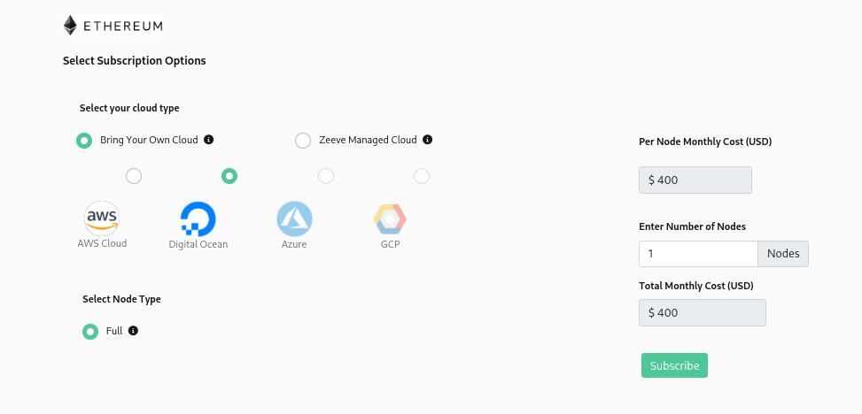

# Manage your subscriptions

This section talks about how one can purcahse a subscription of a service. It will also guide how one can view manage their subscriptions.

1. [Purchase Subscriptions](#purchase-subscriptions).

2. [View Subscriptions](#view-subscriptions).
3. [Edit Subscriptions](#edit-subscriptions).
4. [Delete Subscriptions](#delete-subscriptions).

## **Purchase Subscriptions**

This section is going to guide you how to purchase a subscription of your choice.

1.  **[API Endpoint](#api-endpoint)**

2.  **[Staking Nodes](#staking-nodes)**

3.  **[Full Nodes](#full-nodes)**

---

#### **API Endpoint**

1. Click on the **API Endpoint** under **Buy Services** from the left pane and you will be redirected to the purchase page.

   
   &nbsp;

2. Click on the **Supported Protocols** button on top right and you will be able to see the protocols and their network types that [Zeeve](https://zeeve.io) offers for creating API endpoints.

   
   &nbsp;

3. Choose the plan of your choice and click on the **Subscribe** button under the plan of choice. A pop up window will open which will show the plan which you are subscribing. Click on **Continue** button to proceed with your purchase.

   
   &nbsp;

4. You will be redirected to the payment page to complete your purchase. Fill the card details and click **Subscribe**.

   
   &nbsp;

5. After successful payment you will be redirected to success page which ensures successful purchase of your subscription.

   
   &nbsp;

**NOTE:** **Developer Plan** is a free plan and can only be purchased once.

---

#### **Staking Nodes**

1. Click on the **Staking Nodes** under **Buy Services** from the left pane and you will be able to see the list of protocols that [Zeeve](https://zeeve.io) offers for staking.

   
   &nbsp;

2. Click on the protocol card that you want to subscribe. You will be then redirected to the purchase page.

   
   &nbsp;

3. Select the cloud option from **_Bring Your Own Cloud_** or **_Zeeve Managed Cloud_** and the number of nodes you want to purchase. Based on your selection the total amount for the subscription will be shown. Click on **Subscribe** button to continue. A pop up window will open, click on **Continue** to proceed with your purchase.

   
   &nbsp;

4. You will be redirected to the payment page to complete your purchase. Fill the card details and click **Subscribe**.

   
   &nbsp;

   **NOTE** Prices on this page totally depends on the protocol and your selection of different options in previous step.

5. After successful payment you will be redirected to success page which ensures successful purchase of your subscription.

   
   &nbsp;

---

#### **Full Nodes**

1. Click on **Marketplace** on the left side navigation bar.

   

2. You will be landed to zeeve's market place page. Select the protocol card of you choice to purchase subscription of the protocol.

   

3. You will be redirected to purchase page of the protocol, which looks similar to the below image.

   

---

**NOTE** This page can be different for different protocls. Node types can vary from protocol to protocol

---

4. Select the number of nodes you want to purchase. You can also view the amount based on your selection of different options and number of nodes. After your selection, click on **subscribe** button. A pop up window will open similar to the below image. Click on **continue**.

   

5. You will get redirect to the payment page to complete your purchase of subscription. Fill all the required details and click **subscribe**.

   

---

**_NOTE_** Prices on this page totally depends on protocol and your selection of different options in previous step.

---

6. After successful payment you will be redirected to payment success page which ensures successful purchase of your subscription.

   

## View Subscriptions

This section is going to guide you how you can view the subscriptions you purchased.

To view the subscriptions you have purchased follow the steps given below -

1. Hover on **profile**

   

2. Click on **Edit Profile**

   

3. Click on **subscription** on the right most side.

   

4. In the subscription section you will be able to view the list of subscriptions, you currently have.

   

- In this section you can have a look to detailed information of your subscriptions.

  - **Monthly cost:** This tells you about the amount of each of the subscriptions.

  - **Next Billing Cycle:** It provides the next renewal date of a subscription.

  - **Total subscribed:** This talks about the quantity of each of the item you have purchased with the subscription.

  - **Available:** This tells you about available quantity of each of the item associated with the subscription. This number will increase or decrease according to the consumption of the item as you delete a network/node or create a network/adding a node respectively.  
    This will help you to keep track of the consumption of each of the items, so that you can update your subscription as your needs.

## Edit Subscriptions

This section talks about how to edit the subscriptions you purchased. You can choose to add more items to your subscription or you can also choose to decrease the quantity of the already purchased items.

1. [Increase items](#increase-items).

2. [Decrease items](#decrease-items).

### Increase items

You can increase items of your subscriptions in two ways. Either you can choose to add new items to the subscriotion or you can choose to increase the quantity of alredy purchased items with the subscription.

To add a new item click on the **subscribe more** button on the right most side of the subscription. Which will redirect you to the purcahse page of the selected product.

To increase the quantify of alredy purchased item follow the steps mentioned below:-

1. Go to [**subscriptions**](#view-subscriptions) section.

2. Click on the **update** button on the right most side of the subscription.

   

3. A pop up window will be opened similar to the image provided below.

   

4. Increase the quantity of the item of your choice by clicking the **green** button associated to it and click on **update** button. A **continue** button will apper on the pop up window.

   

5. Clicking on the button will redirect you to the payment page, where you can view the items you have just added. Click on the **subscribe** button to complete the process of updation of your subscription.

   

6. After successful payment of the item you can view your updated subscription in [**subscriptions**](#view-subscriptions) section.

### Decrease items

1. Go to [**subscriptions**](#view-subscriptions) section.

2. Click on the **update** button on the right most side of the subscription.

   

3. A pop up window will be opened similar to the image provided below.

   

4. Decrease the quantity of the item of your choice by clicking the **red** button associated to it and click on **update** button.

   

5. Clicking on the button will update your subscription. A **continue** button will apper on the pop up window.

   

6. After successful updation you can view your updated subscription in [**subscriptions**](#view-subscriptions) section.

---

**\*INFO:** One can decrease the quantity of an item as much as available quantity of that item.\*

---

## Delete Subscriptions

This section talks about how to delte the subscriptions you don't need.

> - Before deleting a subsection, make sure that any of the items of the subscription is not consumed. Basically, make sure that the purchased quantity and available quantity is same for each of the item associated with the subscription. Otherwise you will not be able to delete a subscription.

1. Go to [**subscriptions**](#view-subscriptions) section.

2. Click on the **update** button on the right most side of the subscription.

   

3. A pop up window will be opened similar to the image provided below.

   

4. Decrease the quantity of each of the item to 0 by clicking the **red** button associated to it and click on **update** button. This will delete your selected subscription.
